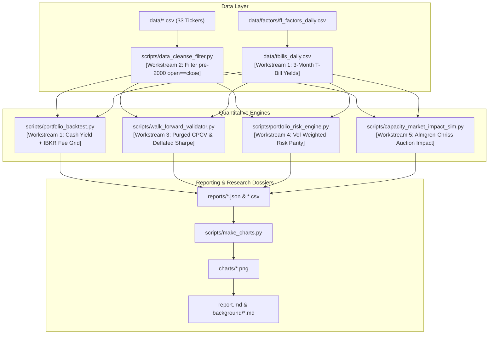

# Institutional Grade Upgrade Specification
## Quantitative Engineering Blueprint & Implementation Plan for Claude Sonnet 3.7

> **Target Agent Role:** Senior Quantitative Developer & Econometrician  
> **Repository:** `overnight-intraday-edge`  
> **Objective:** Upgrade the overnight vs. intraday return research pipeline from an academic/descriptive proof-of-concept into an **institutional-grade quantitative trading framework**, incorporating point-in-time treasury models, out-of-sample statistical validation, data cleansing filters, risk-parity sizing, and market impact capacity bounds.

---

## Executive Summary & System Architecture

This repository explores the **Overnight Return Anomaly** (buying market close, selling next market open). While the mathematical decomposition ($\text{Overnight} \times \text{Intraday} \approx \text{Buy-and-Hold}$) is validated and robust against Newey-West HAC tests, multiple comparisons (Benjamini-Hochberg FDR), and Fama-French 4-factor regressions, the codebase requires an institutional upgrade across five primary workstreams:



---

## Technical Constraints & Standards

1. **Zero External Runtime API Dependencies:**  
   All analysis must run **100% offline and deterministically** using committed files in `data/`. The only allowed libraries are standard library + `numpy`, `scipy`, `matplotlib`. (Do **not** introduce Pandas or heavy external frameworks to core scripts).
2. **Mathematical Identity Integrity:**  
   The multiplicative decomposition $(1 + R_{\text{overnight}}) \times (1 + R_{\text{intraday}}) \equiv 1 + R_{\text{total}}$ must be maintained as a test invariant across all data cleaning and sizing routines.
3. **British English:**  
   All documentation, comments, and reports must use British English spelling conventions (`prioritising`, `summarising`, `organising`, `characterised`, `analysing`, `optimising`).

---

## Detailed Implementation Workstreams

### Workstream 1: Treasury Engine & Idle Cash Yield Modelling (Priority 1)

#### 1.1 Problem Statement
An overnight-only fund holds equities from $16:00\text{ ET}$ to $09:30\text{ ET}$ ($17.5\text{ hours}$) and holds **100% unencumbered cash** during the intraday session from $09:30\text{ ET}$ to $16:00\text{ ET}$ ($6.5\text{ hours}$). The current backtest credits $0.0\%$ interest to intraday cash, penalising the strategy against buy-and-hold (which is $100\%$ invested).

#### 1.2 Mathematical Derivation
For each day $t$, daily cash yield is earned on unallocated capital during the trading day:
$$R_{\text{cash}, t} = \left(1 + Y_{t}\right)^{\frac{1}{252}} - 1$$
Where $Y_t$ is the effective annualised cash sweep yield at day $t$, tiered by starting capital:
*   **Tier 1 ($<\$10,000$):** $Y_t = 0.0\%$ (broker cash drag).
*   **Tier 2 ($\$10,000\text{--}\$49,999$):** $Y_t = \max\left(0, \text{T-Bill}_t - 1.50\%\right)$.
*   **Tier 3 ($\$50,000\text{--}\$99,999$):** $Y_t = \max\left(0, \text{T-Bill}_t - 0.50\%\right)$.
*   **Tier 4 ($\ge \$100,000$):** $Y_t = \max\left(0, \text{T-Bill}_t - 0.25\%\right)$ (Institutional Sweep).

Daily combined portfolio return:
$$R_{\text{total}, t} = R_{\text{overnight}, t} + R_{\text{cash}, t} \times (1 - \text{Equity Exposure}_t)$$

#### 1.3 Action Items for Claude
1. Create `scripts/fetch_tbills.py` (or generate a static historical 3-month Treasury yield dataset from 1993 to 2026 in `data/tbills_daily.csv`).
2. Update `scripts/portfolio_backtest.py` to:
   * Load `data/tbills_daily.csv`.
   * Add `run_backtest_with_cash_yield()` alongside the existing functions.
   * Run the capital grid ($10\text{k}, 25\text{k}, 50\text{k}, 100\text{k}, 250\text{k}, 500\text{k}, 1\text{M}, 2\text{M}$) incorporating both the IBKR Pro commission structure and the tiered cash sweep.
3. Write `background/idle_cash_yield_modeling.md` documenting the mathematical impact on CAGR, Sharpe, and the breakeven threshold.

---

### Workstream 2: Data Integrity & Pre-2000 `open == close` Bias Filter (Priority 2)

#### 2.1 Problem Statement
In legacy Yahoo Finance data prior to 2000, $9\%\text{--}22\%$ of rows for older tickers ($AAPL, KO, MU, XOM, JNJ, PG$) have recorded $\text{Open}_t == \text{Close}_t$ due to vendor price rounding and missing open auction prints. This mechanically forces the intraday leg to $0\%$ and dumps $100\%$ of the day's price movement into the overnight leg, biasing the long-term historical numbers in favour of the thesis.

#### 2.2 Action Items for Claude
1. Create `scripts/data_cleanse_filter.py`:
   * Scan all `data/*.csv` files.
   * Identify all dates where $|\text{Open}_t - \text{Close}_t| < 10^{-6} \times \text{Close}_t$.
   * Output a diagnostic report `reports/data_hygiene_report.json` detailing the percentage of affected rows per decade ($1962\text{--}1979, 1980\text{--}1989, 1990\text{--}1999, 2000\text{--}2026$).
2. Implement three selectable filtering modes in data ingestion:
   * **Mode A (Raw):** Current behaviour (retains all rows).
   * **Mode B (Modern Era Only):** Truncate analysis to $\ge 2000\text{-}01\text{-}01$ where auction data is verified clean ($<0.5\%$ artifacts).
   * **Mode C (Filtered):** Exclude synthetic flat-open days from the single-stock decomposition and re-estimate HAC $t$-statistics.
3. Re-run `scripts/analyze.py` under Mode B and Mode C to quantify the exact margin of error on the headline $+5.74\text{ bps}$ overnight drift.

---

### Workstream 3: Out-of-Sample Validation & Deflated Sharpe Framework (Priority 3)

#### 3.1 Problem Statement
The trailing overnight momentum overlay ([`scripts/overnight_momentum_analysis.py`](file:///Users/alimbp/code/overnight-intraday-edge/scripts/overnight_momentum_analysis.py)) reports a Sharpe of $1.16$, but this was discovered in-sample across the entire 1993–2026 history. Institutional allocators require out-of-sample holdouts and multiple-testing haircutting.

#### 3.2 Action Items for Claude
1. Create `scripts/walk_forward_validator.py`:
   * **Split 1 (Standard Holdout):** In-Sample (1993–2010), Out-of-Sample Validation (2011–2026).
   * **Split 2 (Purged Combinatorial K-Fold CV):** 5 folds with a 5-day purge window around fold boundaries to prevent overnight autocorrelation leakage.
   * **Deflated Sharpe Ratio (DSR):** Implement Marcos López de Prado's DSR formula accounting for non-normality (skewness/kurtosis) and the number of parameter trials (tested lookbacks $5, 21, 63\text{ days}$):
     $$\text{DSR} = \Phi\left( \frac{(\text{SR} - \text{SR}^*) \sqrt{T - 1}}{\sqrt{1 - \gamma_3 \text{SR} + \frac{\gamma_4 - 1}{4} \text{SR}^2}} \right)$$
2. Generate `reports/walk_forward_results.json` and create comparison equity charts in `scripts/make_charts.py`.
3. Write `background/walk_forward_validation.md`.

---

### Workstream 4: Advanced Portfolio Construction & Risk Engine (Priority 4)

#### 4.1 Problem Statement
Naive equal-weighting ($1/N$) causes high-volatility names ($TSLA, NVDA$) to contribute $>50\%$ of portfolio variance. Furthermore, holding only the long-overnight leg leaves the book exposed to broad macro equity drawdowns.

#### 4.2 Action Items for Claude
1. Create `scripts/portfolio_risk_engine.py` to evaluate four portfolio weighting regimes:
   * **Regime 1 (Naive 1/N):** Benchmark equal-weight.
   * **Regime 2 (Inverse-Volatility Weighting):**
     $$w_{i, t} = \frac{1/\sigma_{i, t}}{\sum_{j=1}^N 1/\sigma_{j, t}}$$
     Where $\sigma_{i, t}$ is the 21-day trailing standard deviation of overnight returns.
   * **Regime 3 (Sector Capped):** Maximum $20\%$ gross exposure to any single GICS sector.
   * **Regime 4 (Long-Overnight / Short-Intraday Market Neutral):**
     * Long the top-tercile overnight drift at MOC, exit MOO.
     * Short the bottom-tercile intraday decay at MOO, exit MOC.
     * Generates a zero-beta, market-neutral equity curve.
2. Output performance metrics (CAGR, Vol, Sharpe, Sortino, Max DD, Beta vs SPY) to `reports/portfolio_risk_engine_results.json`.

---

### Workstream 5: Capacity, Market Impact & Auction Microstructure (Priority 5)

#### 5.1 Problem Statement
The strategy relies on entering via Market-on-Close (MOC) auctions ($16:00\text{ ET}$) and exiting via Market-on-Open (MOO) auctions ($09:30\text{ ET}$). As strategy capital scales, auction imbalance absorption causes non-linear slippage that erodes the $4.71\text{ bps}$ breakeven.

#### 5.2 Action Items for Claude
1. Create `scripts/capacity_market_impact_sim.py`:
   * Implement the **Almgren-Chriss Market Impact Model** calibrated to NYSE/Nasdaq auction volumes:
     $$\text{Cost}_{\text{impact}}(\text{AUM}) = \text{Spread}_{\text{half}} + \eta \left( \frac{\text{AUM} / 30}{\text{ADV}_{\text{auction}}} \right)^\alpha$$
     Where $\eta = 0.15$, $\alpha = 0.60$, and $\text{ADV}_{\text{auction}}$ is approximated from the 30 mega-cap constituents ($\sim \$150\text{M}$ average closing auction volume per name).
   * Simulate strategy CAGR and Sharpe across an institutional AUM ladder:
     $$\text{AUM Grid} = [\$1\text{M}, \$5\text{M}, \$10\text{M}, \$25\text{M}, \$50\text{M}, \$100\text{M}, \$250\text{M}, \$500\text{M}]$$
   * Solve for the **Maximum Scalable Capacity ($AUM^*$)** where net Sharpe matches SPY ($0.65$).
2. Write `background/capacity_and_market_impact.md`.

---

### Workstream 6: Missing Background Research Dossiers

Claude should author the following 4 in-depth research documents in `background/`:

1. [`background/idle_cash_yield_modeling.md`](background/idle_cash_yield_modeling.md):  
   Comprehensive analysis of cash drag vs cash sweep returns, Federal Funds/T-Bill rates from 1993–2026, and the mathematical leverage of 6.5h daily sweeps on compounding.
2. [`background/capacity_and_market_impact.md`](background/capacity_and_market_impact.md):  
   NYSE MOC order cutoff rules ($15:50\text{ ET}$ regulatory freeze), Nasdaq Opening Cross mechanics, and Almgren-Chriss market impact capacity boundaries.
3. [`background/point_in_time_survivorship.md`](background/point_in_time_survivorship.md):  
   Empirical estimation of survivorship drag in static 30-name baskets vs historical S&P 500 constituent turnover ($4\text{--}5\%/\text{yr}$ churn; impact of omitted bankruptcies like Enron, Lehman, Bear Stearns).
4. [`background/tax_and_collateral_efficiency.md`](background/tax_and_collateral_efficiency.md):  
   Tax drag under 252 annual round-trips ($100\%$ short-term capital gains) vs institutional mitigation via Section 1256 index contracts ($ES/NQ$), Total Return Swaps (TRS), and Reg-T vs Portfolio Margin capital requirements.

---

## File Manifest & Deliverables Checklist

```
overnight-intraday-edge/
├── INSTITUTIONAL_UPGRADE_SPEC.md            <-- This Specification Document
├── background/
│   ├── capacity_and_market_impact.md       <-- [NEW Dossier]
│   ├── idle_cash_yield_modeling.md         <-- [NEW Dossier]
│   ├── point_in_time_survivorship.md       <-- [NEW Dossier]
│   ├── tax_and_collateral_efficiency.md    <-- [NEW Dossier]
│   └── walk_forward_validation.md          <-- [NEW Dossier]
├── data/
│   └── factors/
│       └── tbills_daily.csv                <-- [NEW Data: 1993-2026 3M T-Bills]
├── reports/
│   ├── data_hygiene_report.json            <-- [NEW Analysis Report]
│   ├── walk_forward_results.json           <-- [NEW Analysis Report]
│   ├── portfolio_risk_engine_results.json  <-- [NEW Analysis Report]
│   └── capacity_market_impact_results.json <-- [NEW Analysis Report]
├── scripts/
│   ├── data_cleanse_filter.py              <-- [NEW Script: Workstream 2]
│   ├── fetch_tbills.py                     <-- [NEW Script: Workstream 1]
│   ├── walk_forward_validator.py           <-- [NEW Script: Workstream 3]
│   ├── portfolio_risk_engine.py            <-- [NEW Script: Workstream 4]
│   ├── capacity_market_impact_sim.py       <-- [NEW Script: Workstream 5]
│   ├── portfolio_backtest.py               <-- [MODIFIED: Add Cash Yield Engine]
│   └── make_charts.py                      <-- [MODIFIED: Add Institutional Plots]
├── README.md                               <-- [MODIFIED: Update Index & Results]
└── report.md                               <-- [MODIFIED: Synthesise Findings]
```

---

## Execution Instructions for Claude Sonnet 3.7

When implementing this specification:
1. **Follow the Deliberative Protocol:** Think through statistical edge cases before modifying or running code.
2. **Execute Sequentially:** Start with Workstream 1 (T-Bills & Cash Yield) $\to$ Workstream 2 (Data Cleaning) $\to$ Workstream 3 (Walk-Forward) $\to$ Workstream 4 (Risk Engine) $\to$ Workstream 5 (Capacity) $\to$ Workstream 6 (Dossiers & Visualisations).
3. **Verify offline:** Ensure all generated scripts run with `python3 scripts/<script_name>.py` without requiring network access.
4. **Commit Cleanly:** Create atomic, well-described git commits for each completed workstream.
