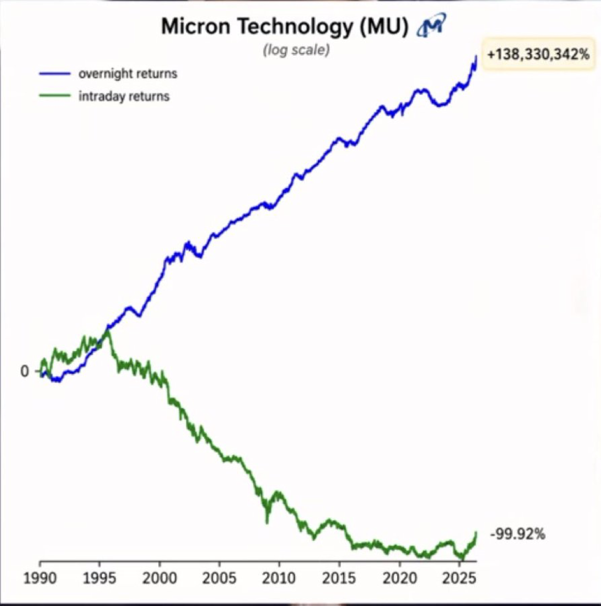

# Overnight vs. Intraday Returns: Is There a General Edge?

A test of whether Micron's viral "buy the close, sell the open" chart is a market-wide edge or a single-stock fluke, using 33 sector-diversified large-caps and their full available price history (1962-2026 depending on listing date).

## Why this exists

This started from a viral tweet claiming MU is up **+138,330,342%** since 1990 if you only held it overnight (close→open), and **-99.92%** if you only held it during the trading day (open→close).



Source: [@wheelieinvestor on X](https://x.com/wheelieinvestor/status/2090827673136472542?s=48). Reproduced here for commentary/attribution purposes as the inspiration for this analysis; all rights to the original post belong to its author.

That claim [checks out](report.md#appendix-the-original-mu-claim) against real data. This project asks the harder question: **does that generalize into a real, tradable edge, or is MU an outlier?**

**→ [Read the full report](report.md)**

> **v2:** rebuilt after an institutional-style methodology review. Fixed a dividend-adjustment bug that was leaking ex-dividend price drops into the overnight leg, added Newey-West HAC-robust significance testing, added a Fama-French factor regression to test whether the effect is repackaged momentum (it isn't), and excluded SPY/QQQ/MU from cross-sectional pooling to remove double-counting/selection bias. Details in [report.md](report.md#1-method).

## Headline result

| Question | Answer |
|---|---|
| Is the MU chart's math right? | Yes, independently reproduced. |
| Does MU's *extreme* pattern (huge overnight gain, losing intraday) generalize? | **No.** Only MU, BAC, and FCX show it out of 33 names. |
| Is there a real, general overnight-return effect? | **Yes.** 26 of 30 sector-diverse large-caps (excl. SPY/QQQ/MU) remain significant after Benjamini-Hochberg FDR correction, vs. ~1.5 expected by chance, matching published academic literature. |
| Does it concentrate anywhere? | **Yes**, in growth/high-attention sectors (Tech, Consumer Discretionary, Comm Services, Financials). It *reverses* in Staples, Energy, Utilities. |
| Is it repackaged momentum? | **No.** Momentum-factor loading on the overnight leg is statistically zero (t=0.13) after a HAC-robust 4-factor regression; 16/30 tickers keep significant alpha net of market/size/value/momentum. |
| Is it persistent over time? | Reasonably: 0.65 cross-sectional correlation between first-half and second-half overnight returns per ticker. |
| Is it a free lunch net of costs? | **No.** Median breakeven round-trip cost is ~4.2bps; even the best cases (TSLA, MU, NVDA) only tolerate ~13-15bps before the entire multi-decade edge disappears. |
| Does it matter which weekday you buy the close on? | **Yes.** Monday's close is the strongest of the week (27.4% mean annualized, vs. 15-18% Tue-Thu); Friday's close, the weekend gap, is the weakest (7.8%), both significant (p<0.001). Not independently confirmed in the academic literature, new to this project. See [`background/day_of_week_analysis.md`](background/day_of_week_analysis.md). |
| Is it just a few earnings-like pops? | **No, mostly.** Only ~1.7% of days are extreme gaps (>3 std dev), and 27/30 tickers stay significant with those days removed (mean annualized return only falls 16.4%→14.5%). A handful of names (TSLA, HD, BAC, GOOGL, NVDA, AVGO) lean more heavily on tail events than the average name. See [`background/extreme_gap_analysis.md`](background/extreme_gap_analysis.md). |

**Bottom line:** the overnight effect is real, academically well-documented (Berkman et al. 2012; Lou, Polk & Skouras 2019), survives multiple-comparisons correction, and is not just repackaged momentum exposure. But it's a growth-stock/retail-attention characteristic concentrated in about a third of the market, not a market-wide law, and it's economically thin enough that realistic trading costs erase it for most individual names. MU is the extreme tail of a real distribution, not a template.

## Reproduce it (fully offline)

`data/*.csv` (33 tickers, dividend+split adjusted, full available history per ticker) and `data/factors/ff_factors_daily.csv` (Fama-French factors) are committed to this repo, so the analysis and every chart reproduce **offline, deterministically, with no network access or API keys**:

```bash
pip install numpy scipy matplotlib   # only the offline-analysis deps, see requirements.txt
python3 scripts/analyze.py               # overnight/intraday decomposition + HAC t-tests + factor regression -> reports/
python3 scripts/day_of_week_analysis.py  # weekday breakdown -> reports/day_of_week_results.json
python3 scripts/extreme_gap_analysis.py  # tail-event decomposition -> reports/extreme_gap_results.json
python3 scripts/make_charts.py           # -> charts/
```

`scripts/fetch_data.py` (fresh price data via `yfinance`/`curl_cffi`) and `scripts/fetch_factors.py` (fresh Fama-French factors) are only needed to refresh the dataset; both skip files that already exist and are not required to reproduce the existing report.

## Layout

```
report.md                     full write-up (start here)
scripts/fetch_data.py         pulls full daily OHLC for the 33-ticker universe, dividend+split adjusted
scripts/fetch_factors.py      pulls Fama-French daily factors (Mkt-RF, SMB, HML, Momentum)
scripts/stats_utils.py        Newey-West HAC-robust OLS/mean-test implementation
scripts/analyze.py            overnight/intraday decomposition, HAC t-tests, breakeven cost, sub-period split, factor regression
scripts/day_of_week_analysis.py  breaks the overnight leg down by weekday of the close bought
scripts/extreme_gap_analysis.py  tests how much of the edge depends on tail-event (earnings-like) gap days
scripts/make_charts.py        generates every chart in report.md
data/                         cached daily OHLC per ticker + universe.json (sector map) + factors/
reports/                      per_ticker_results.json, summary.json, day_of_week_results.json, extreme_gap_results.json
charts/                       generated figures
background/mu_claim_validation.md      the research trail that led to this repo
background/literature_review.md        7-paper literature review of the overnight-return anomaly, 1986-2025, with links
background/youtube_videos.md           popular YouTube coverage of the overnight-return effect, summarized
background/day_of_week_analysis.md     does it matter which weekday you buy the close on?
background/extreme_gap_analysis.md     is the edge just a few earnings-like pops?
```

## Disclaimer

Research only, not investment advice. See [report.md](report.md#limitations) for limitations (no taxes/execution-mechanics modeled, flat-cost assumption, survivorship within "still-large-cap-today" names).
