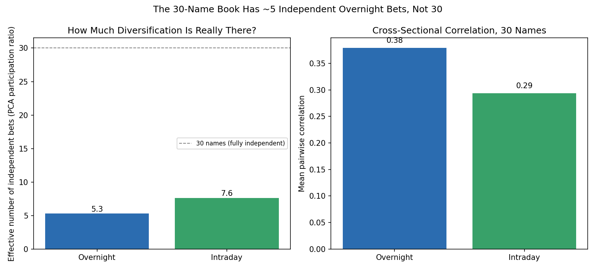
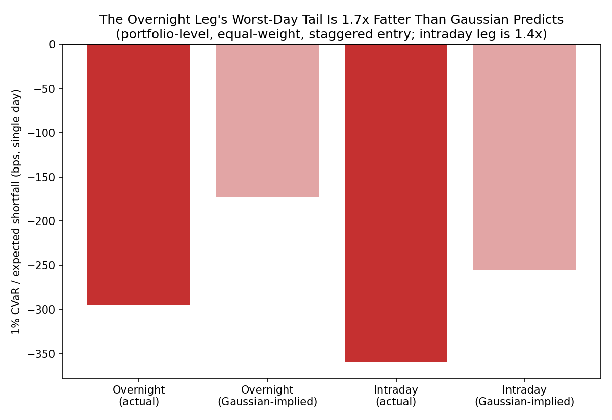

# Correlation structure and tail risk: how much diversification is really there?

**Question:** the portfolio backtest's headline claim is that the equal-weight overnight book has roughly half SPY's volatility and a better Sharpe ratio. That claim is only as good as the assumption that the 30 overnight legs move independently of each other. If they mostly gap together on the same macro nights, the book has far fewer genuinely independent bets than 30 names suggests, and its attractive Sharpe ratio is partly an artifact of the mean/variance framework not seeing the risk that matters: correlated, fat-tailed crashes.

**Method:** `scripts/correlation_tail_risk_analysis.py`, run on data already on disk, no new fetch needed. Two separate questions:

1. **Correlation / effective bets.** Build the 30x30 cross-sectional correlation matrix of the daily overnight returns (on the common-date window where all 30 names have data, 2012-05-21 to 2026-08-21), then decompose it into principal components. The "effective number of independent bets" is Meucci's participation-ratio measure, PR = (sum of eigenvalues)^2 / sum(eigenvalues squared), bounded between 1 (a single common factor drives everything) and 30 (fully independent). A portfolio's realized volatility only diversifies down by roughly the square root of the effective bets, not the square root of 30.
2. **Tail risk.** The Sharpe ratio is a mean/variance statistic and is blind to skew and kurtosis. `execution_mechanics.md` already warns in prose that an overnight position cannot be exited if a shock hits while the market is closed; this quantifies it with skewness, excess kurtosis, historical CVaR (expected shortfall) at the 1% tail, and a worst-10-days table, each compared against what a Gaussian distribution with the same mean and volatility would predict, and against the intraday leg for reference.

Portfolio-level numbers reuse `portfolio_backtest.run_backtest` at 0bps cost, so this is the same equal-weight, staggered-entry book already analyzed in the backtest, not a new construction.

## Result 1: the 30-name book has about 5 independent bets, not 30

| Leg | Mean pairwise correlation | PC1 variance share | Effective independent bets (of 30) |
|---|---:|---:|---:|
| Overnight | 0.38 | 41.4% | 5.3 |
| Intraday | 0.29 | 32.3% | 7.6 |

The overnight leg is *more* correlated across names than the intraday leg, not less: a single common factor (almost certainly a broad market-direction factor, since the overnight window is exactly when scheduled macro data, Fed decisions, and overseas market moves land) explains 41% of the cross-sectional variance in overnight returns, versus 32% for intraday moves during the trading session itself. This is a real caveat to the backtest's headline volatility comparison against SPY: a 30-name equal-weight book behaves, in terms of diversification, closer to a 5-name book. The realized 10-11% annualized volatility reported in `portfolio_backtest.md` is the true number (it's measured directly from the equity curve, not inferred from a diversification assumption), but the *reason* it isn't lower despite holding 30 names is this correlation structure, and it means the book's risk is concentrated in "everyone gaps down together" nights rather than spread evenly across 30 idiosyncratic risks.

## Result 2: the overnight leg's downside tail is fatter than the intraday leg's, relative to Gaussian

| | Actual 1% CVaR | Gaussian-implied 1% CVaR | Fat-tail multiple |
|---|---:|---:|---:|
| Overnight portfolio | -295.6bps | -172.9bps | **1.71x** |
| Intraday portfolio | -359.5bps | -255.0bps | 1.41x |

The intraday leg has the larger *absolute* worst-case loss (it's simply the more volatile leg overall), but the overnight leg's tail is proportionally fatter relative to what its own volatility would predict under a normal distribution: excess kurtosis of 25.5 (a Gaussian has 0) and skew of -1.26 (a strongly asymmetric left tail). Concretely, the overnight portfolio's actual 1% CVaR is 71% worse than a Gaussian with the same mean and volatility would imply, versus 41% worse for the intraday leg. This is the quantified version of the un-exitable-gap-risk warning already in `execution_mechanics.md`: the overnight leg's Sharpe ratio looks attractive partly because a second-moment statistic cannot see that its downside surprises are disproportionately large and disproportionately synchronized across names.

The worst 10 single days for the equal-weight overnight portfolio, in order:

| Date | Return |
|---|---:|
| 2020-03-16 | -11.54% |
| 2020-03-09 | -7.64% |
| 2008-10-24 | -7.59% |
| 2020-03-12 | -7.15% |
| 2015-08-24 | -6.43% |
| 2020-03-18 | -6.26% |
| 2008-01-22 | -5.32% |
| 2008-10-10 | -4.69% |
| 2024-08-05 | -3.76% |
| 2001-09-21 | -3.62% |

Eight of the ten worst days cluster into just three windows: the March 2020 COVID crash (four separate days), the 2008 Global Financial Crisis (three days), and the August 2015 China-deval flash-crash episode. This is the correlation finding made concrete: this is not a book that loses money on scattered idiosyncratic bad-earnings nights, it is a book that loses money in a handful of correlated systemic-crisis windows, exactly the crisis windows already tracked in `portfolio_backtest.py`'s `CRISIS_WINDOWS`. A single -11.5% overnight day (2020-03-16) is a loss no stop-loss or intraday risk control could have prevented, since the position cannot be exited between the prior close and that morning's open.

## What this changes

Nothing in the headline conclusion of `report.md` or `portfolio_backtest.md` is overturned; the realized CAGR, Sharpe, and max-drawdown numbers there are unaffected since they're measured directly, not derived from a diversification assumption. What this adds is the mechanism: the strategy's risk is not "30 small idiosyncratic bets," it is closer to "5 correlated macro-direction bets," and its downside is fatter-tailed than its Sharpe ratio alone would suggest. Anyone sizing this strategy on a target-Sharpe or target-volatility basis, rather than on the realized backtest history directly, should discount the diversification benefit accordingly and expect the worst days to be correlated with, not independent of, broad market stress.
