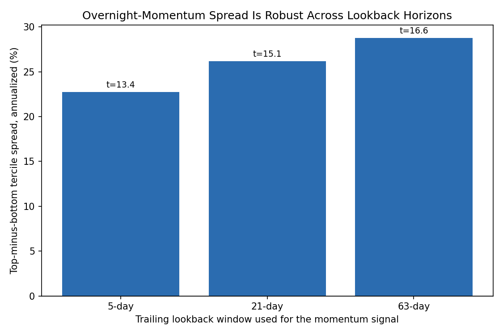
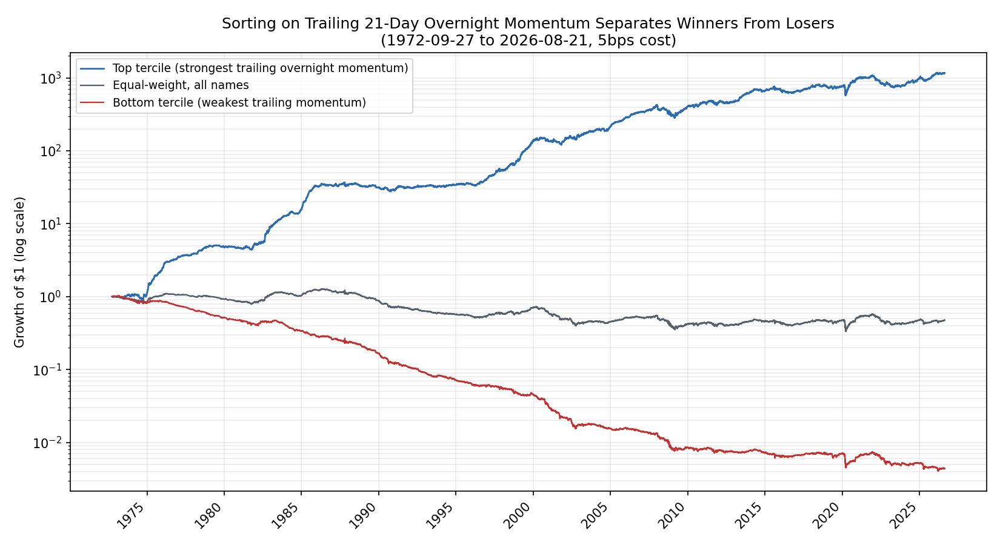

# Does a stock's own trailing overnight performance predict its future overnight performance?

**Question:** `background/literature_review.md` cites Lou, Polk & Skouras (2019) for the claim that overnight returns have their own predictive persistence, distinct from ordinary price momentum. `report.md`'s factor regression (section 4) tested something narrower and already answered: whether the overnight leg loads on the Fama-French *cross-sectional momentum factor* (it doesn't, t = 0.13). This is the actual LPS-style test that was never run: does a stock's own recent overnight track record predict its next overnight return, and is that a real, tradeable, no-look-ahead signal?

**Method:** `scripts/overnight_momentum_analysis.py`, entirely local, no new data. For each ticker, on each day, computes a trailing signal, the mean of that ticker's own overnight returns over the last N trading days, using only overnight legs that were already realized by the time that day's close is bought (there is no look-ahead: the signal for the position entered at yesterday's close only uses data known by yesterday's close). Each day, ranks all tickers with a valid signal into terciles, forms an equal-weight top-tercile and bottom-tercile portfolio from their *forward* (next) overnight return, and tests whether top beats bottom by more than noise via a HAC-robust mean test on the daily top-minus-bottom spread. Tested at three lookback horizons (5, 21, 63 trading days) since the literature doesn't specify one; 21 days (about a month) is the headline case.

## Result: a large, highly significant, and horizon-robust spread

| Lookback | n (ticker-days) | Top tercile | Bottom tercile | Spread | t-stat |
|---|---:|---:|---:|---:|---:|
| 5-day | 13,603 | 27.95% | 4.26% | 22.72% | 13.37 |
| 21-day | 13,587 | 30.21% | 3.21% | 26.17% | 15.14 |
| 63-day | 13,545 | 31.15% | 1.85% | 28.77% | 16.61 |

(annualized returns, pooled across the 30-ticker cross-section, gross of cost)

The spread is not only significant at every horizon tested, it strengthens with a longer lookback, which argues against it being a microstructure artifact of very short-term mean reversion or bid-ask bounce (a spurious short-horizon effect would typically fade, not strengthen, as the window lengthens).

## The headline 21-day equity curve

Using the 21-day signal, forming top-tercile-only, bottom-tercile-only, and equal-weight-all portfolios at the same flat 5bps round-trip cost used elsewhere in this project:

| Portfolio | CAGR | Vol | Sharpe | Max drawdown |
|---|---:|---:|---:|---:|
| Top tercile (momentum) | 13.99% | 11.92% | **1.16** | -33.3% |
| Equal-weight, all names | -1.37% | 9.28% | -0.10 | -74.0% |
| Bottom tercile | -9.58% | 11.12% | -0.85 | -99.6% |

**Important caveat on the window:** this equal-weight-all number is measured over 1972-09-27 to 2026-08-21, a different and much longer window than `portfolio_backtest.md`'s headline 1993-2026 (SPY-anchored) backtest, because the momentum signal requires trailing history and this dataset includes seven tickers with data back to 1962. Before the mid-1990s only a handful of names (as few as 9) have both enough history for the signal and are present at all, so the earliest decades of this equal-weight-all comparison are a much thinner, less diversified book than the 30-name portfolio analyzed elsewhere in this project. **This is not a restatement or contradiction of the main portfolio backtest's headline numbers** (that backtest's -0.73% flat-cost CAGR over 1993-2026 stands as reported); it is a different, longer window, shown here because the momentum signal needs it. To check the spread isn't purely an artifact of that thin early period, the same three portfolios restricted to 1993-2026 (matching the main backtest's window) show: top tercile CAGR 11.21% (Sharpe 0.89), equal-weight-all -0.84% (Sharpe -0.03), bottom tercile -8.57% (Sharpe -0.66). The spread survives essentially intact in the modern, fully-diversified era, so this is not just a small-sample artifact of the 1970s-80s.

## A real alternative explanation worth naming honestly

The bottom-tercile portfolio compounds to essentially zero (a wealth multiple of 0.0044 after 54 years, or -8.57% CAGR since 1993 alone). Part of what a "bottom tercile of trailing overnight momentum" sort can pick up, over long horizons, is not a short-term predictive signal so much as persistent structural quality or distress differences between companies. A stock that has been a genuinely weak performer for a sustained period is, on average, more likely to keep being one; that is a real and useful thing to know for portfolio construction, but it is a different claim from "overnight returns specifically, as opposed to returns generally, have their own momentum." This project does not have the machinery in place (a matched all-session momentum comparison controlling for ordinary price momentum) to fully separate a distinct overnight-specific effect from ordinary persistence in stock quality; the Fama-French momentum-factor test in `report.md` section 4 addresses a related but not identical question, since it tests loading on a *market-wide* momentum factor at a point in time, not this ticker's own trailing overnight-specific return path.

## What this changes

Nothing in the core report or the main portfolio backtest is revised. What this adds is a genuinely new, actionable finding not previously tested in this project: naive equal-weighting across all 30 names, as the main backtest does, is very likely leaving return on the table. A simple momentum overlay, selecting only the top tercile by trailing overnight performance, produces a materially better risk-adjusted result (Sharpe 0.89-1.16 depending on window) than either the equal-weight book or, per `portfolio_backtest.md`, SPY buy-and-hold's 0.65 Sharpe. This is the most promising concrete next step for anyone actually trying to implement this strategy, alongside the capital-size threshold already established in the realistic-cost work, though the distress-versus-momentum ambiguity above means it should be read as "recent relative performance predicts relative performance," not proof of a distinct overnight-specific anomaly.
