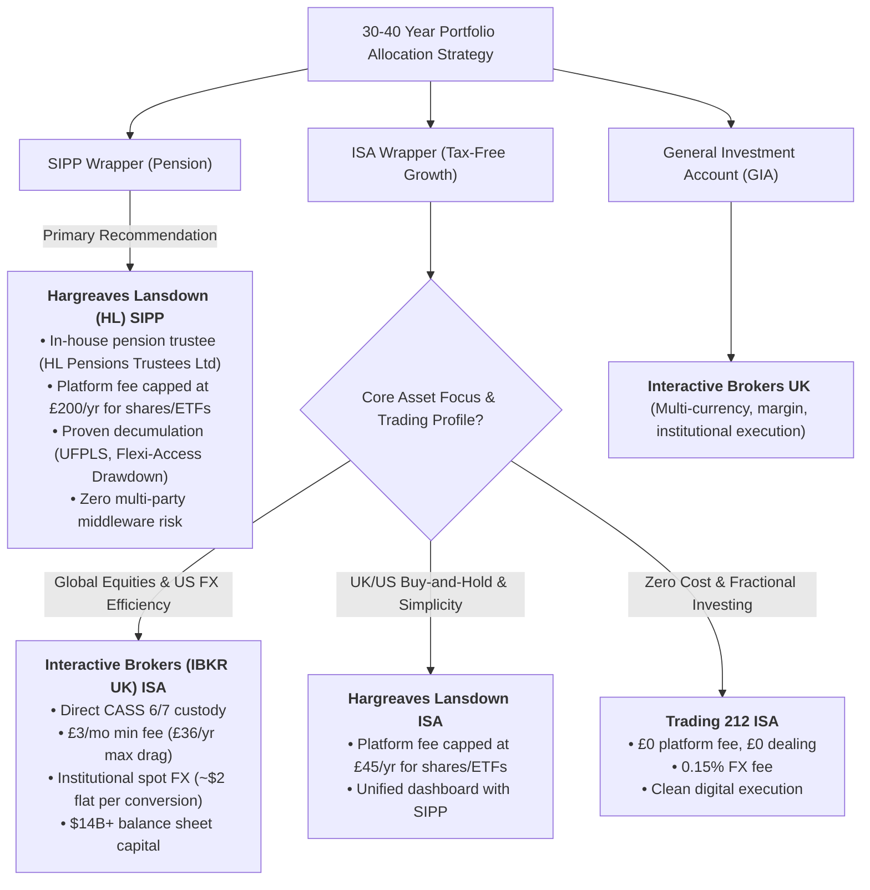
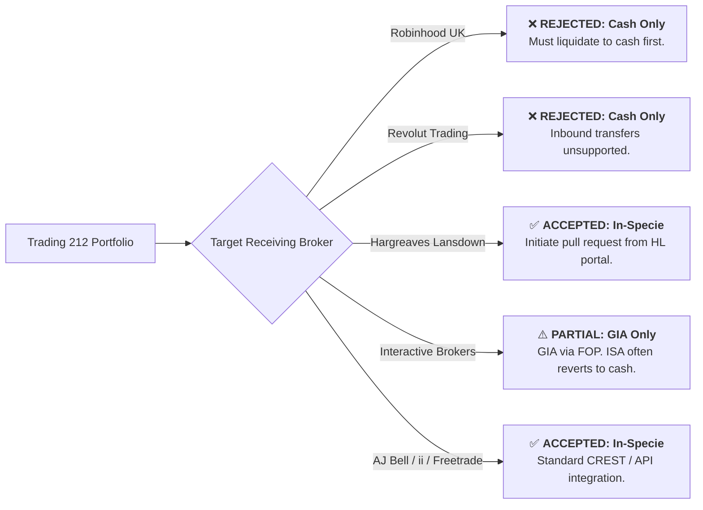
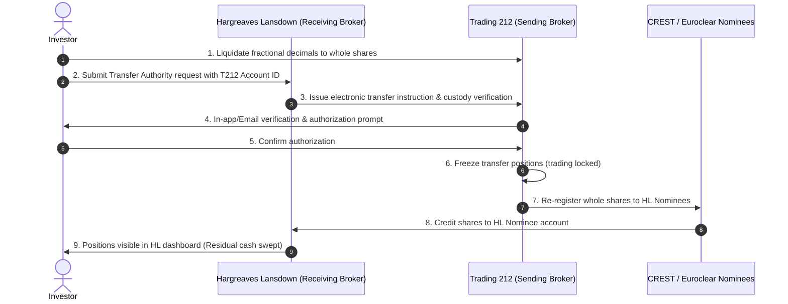
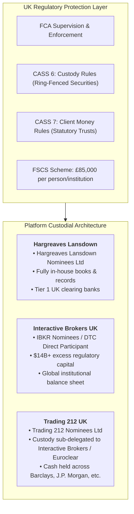
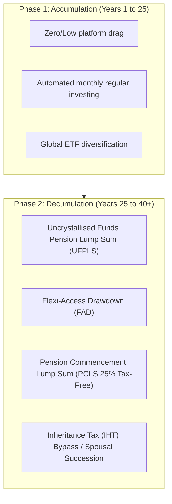
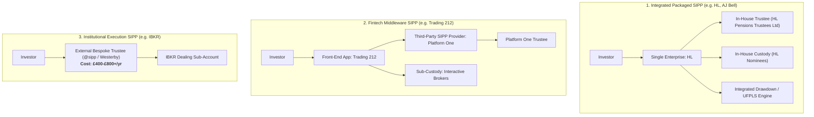
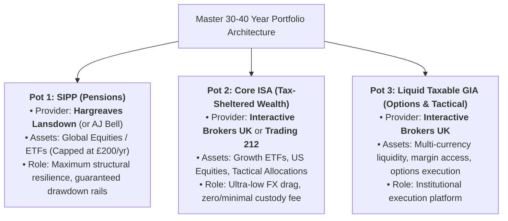

# UK Broker Custodial Architecture, In-Specie Transfers, and 30–40 Year SIPP & ISA Strategy Dossier

**Author:** Antigravity  
**Context:** UK Wealth Architecture, Custodial Risk Analysis, Pension Engineering  
**Scope:** Trading 212, Robinhood UK, Revolut Trading, Hargreaves Lansdown, Interactive Brokers (IBKR UK)  
**Date:** August 2026  
**Jurisdiction:** United Kingdom (FCA / HMRC / CASS / FSCS)

---

## Executive Summary & Strategic Verdict

This dossier provides an exhaustive institutional and regulatory audit of five primary retail brokerage platforms operating in the United Kingdom (**Trading 212, Robinhood UK, Revolut Trading, Hargreaves Lansdown, and Interactive Brokers UK**), alongside benchmark context for **AJ Bell** and **Interactive Investor**.

The evaluation focuses on two critical operational and strategic requirements:
1. **In-Specie Transfer Mechanics & Interoperability:** Transferring equity and ETF positions across providers without triggering taxable disposals or losing tax-wrapper integrity.
2. **30–40 Year Horizon Asset Preservation:** Structural resilience, CASS ring-fencing, FSCS resolution mechanics, SIPP trustee governance, fee drag compounding, and retirement decumulation readiness.



---

## Section 1: In-Specie Transfer Interoperability Matrix

An *in-specie* (in-kind) transfer moves the legal ownership of whole shares and ETFs between broker nominee accounts without selling the underlying assets, preserving market exposure and avoiding capital gains tax (CGT) events in taxable accounts.



### Institutional Broker Transfer Compatibility Matrix

| Broker | Inbound In-Specie Supported? | Outbound In-Specie Supported? | ISA Transfer Rails | Fractional Share Treatment | Transfer Initiation Mechanism |
| :--- | :---: | :---: | :---: | :--- | :--- |
| **Trading 212** | **Yes** | **Yes** | In-Specie & Cash | Must liquidate to cash | Automated via app or manual CREST/Euroclear form |
| **Robinhood UK** | **No** | **Yes** (ACATS, fee applies) | Cash Only | Must liquidate to cash | In-app transfer request (liquidates positions) |
| **Revolut Trading** | **No** | **Yes** (ACATS/DTC, fee applies) | N/A (No ISA) | Must liquidate to cash | Inbound not supported; Outbound via receiving broker |
| **Hargreaves Lansdown** | **Yes** | **Yes** | In-Specie & Cash | Must liquidate to cash | Online Transfer Authority form via HL web portal |
| **Interactive Brokers UK** | **Yes (GIA)** / Limited (ISA) | **Yes** | Mostly Cash | Must liquidate to cash | FOP (Free of Payment) via Client Portal |
| **AJ Bell** | **Yes** | **Yes** | In-Specie & Cash | Must liquidate to cash | Digital or paper transfer authority |
| **Interactive Investor (ii)** | **Yes** | **Yes** | In-Specie & Cash | Must liquidate to cash | Digital account transfer form |

---

## Section 2: Technical Protocol for In-Specie Transfers (Trading 212 $\rightarrow$ Hargreaves Lansdown)

Because UK equity settlement follows the "pull" protocol, transfers must always be initiated by the **receiving broker (Hargreaves Lansdown)**.



### Step-by-Step Execution Protocol

1. **Pre-Transfer Audit & Ticker Verification:**
   * Audit every line item on [hl.co.uk](https://www.hl.co.uk) to verify HL offers dealing in the exact ISIN/ticker.
   * If an obscure European stock, non-standard ADR, or niche micro-cap is not listed on HL, it cannot be transferred in-specie and must be sold to cash or left behind.
2. **Fractional Share Liquidation:**
   * Market settlement systems (CREST, Euroclear, DTCC) only support integer unit settlement.
   * *Example:* If holding `15.75` shares of NVDA in Trading 212, liquidate `0.75` shares to cash, leaving exactly `15.00` whole shares.
3. **Account Wrapper Matching:**
   * Target accounts must match exactly: **Trading 212 ISA $\rightarrow$ HL Stocks & Shares ISA**; **Trading 212 Invest $\rightarrow$ HL Fund & Share Account (GIA)**. Cross-wrapper transfers are prohibited under HMRC regulations.
4. **Initiation via HL Portal:**
   * Log into HL $\rightarrow$ `Transfers` $\rightarrow$ `Transfer an existing account to HL`.
   * Input Sending Institution: `Trading 212 UK Ltd`.
   * Input Account Identifier: Trading 212 Account ID (found in `Menu > Settings > Account details`).
   * Select **"Transfer as stock / In-specie"**.
5. **Authorization & Settlement Monitoring:**
   * Confirm the transfer prompt in the Trading 212 app.
   * Trading 212 freezes the positions. Settlement typically completes within **2 to 4 weeks** for UK equities/ETFs and **3 to 6 weeks** for US-listed securities.
6. **Book Cost Reconciliation (GIA Only):**
   * Transferred shares frequently arrive in HL with a cost basis adjusted to the transfer date's market value.
   * **Mandatory Action:** Download and archive historic Trading 212 monthly statements and tax certificates to preserve Section 104 historic pool costs for UK Capital Gains Tax reporting.

---

## Section 3: Custodial Architecture, CASS Sourcebook, and Insolvency Resolution

Evaluating broker safety over a **30–40 year horizon** requires an audit of legal ownership structures, client asset segregation (FCA CASS 6 and CASS 7), and insolvency resolution mechanics.



### Detailed Structural Comparison

| Dimension | Hargreaves Lansdown (HL) | Interactive Brokers UK (IBKR) | Trading 212 (T212) | Robinhood UK | Revolut Trading |
| :--- | :--- | :--- | :--- | :--- | :--- |
| **UK Legal Entity** | Hargreaves Lansdown Asset Management Ltd | Interactive Brokers (U.K.) Limited | Trading 212 UK Limited | Robinhood UK Ltd | Revolut Ltd / Revolut Securities Europe UAB |
| **FCA Firm Reference** | `115248` | `208159` | `609146` | `823590` | `882462` / Bank of Lithuania |
| **Primary Nominee Entity** | `Hargreaves Lansdown Nominees Limited` | `Interactive Brokers Nominees` | `Trading 212 Nominees Limited` | Robinhood Securities Nominee | Third-Party US Broker Nominee (DriveWealth) |
| **Balance Sheet Strength** | £150B+ AUA; 40-year history | $14B+ regulatory capital; NASDAQ listed ($IBKR) | High net margins; £5B+ AUA; zero debt | Publicly traded ($HOOD); VC-backed growth | Profitable global fintech; banking licence |
| **Sub-Custody Network** | Direct CREST / Euroclear settlement | Direct DTCC / CREST / Eurex / Global Exchanges | Sub-custodied via Interactive Brokers & Euroclear | Sub-custodied via Robinhood Securities LLC (US) | Sub-custodied via DriveWealth LLC (US) |
| **FSCS Protection** | £85,000 | £85,000 | £85,000 | £85,000 | £85,000 (UK) / €22,000 (EU) |
| **Insolvency Resolution Complexity** | **Low:** Clean, unified internal ledger; Special Administration Regime. | **Low:** Massive proprietary capital buffer; direct market clearing. | **Moderate:** Multi-layered reconciliation between T212 internal ledger and IBKR sub-custodian. | **Moderate:** Cross-border UK-to-US entity resolution. | **Moderate/High:** App layer separated from US clearing partner (DriveWealth). |

---

## Section 4: 30–40 Year SIPP Architecture (Accumulation vs Decumulation)

A pension pot held over 30–40 years moves through two fundamentally distinct phases: **Accumulation** (asset building) and **Decumulation** (retirement drawdown, tax-free cash extraction, and intergenerational wealth transfer).



### Deep Dive: Packaged SIPP vs Bespoke/Middleware SIPP



### Evaluation of SIPP Providers for Decades-Long Holding

#### 1. Hargreaves Lansdown (HL) SIPP — **Grade: A**
* **Trustee Model:** Proprietary in-house trustee (`Hargreaves Lansdown Pensions Trustees Limited`). No third-party dependency.
* **Fee Structure for ETFs/Shares:** 0.45% annual platform fee, **capped at £200/year**. 
* **Drawdown Capability:** Industry gold standard. Seamless execution of UFPLS, partial crystallisation, flexible drawdown, and nominated beneficiary succession without third-party friction.
* **Verdict:** The safest long-term SIPP option among standard retail platforms.

#### 2. Trading 212 SIPP — **Grade: B-**
* **Trustee Model:** White-labelled integration with **Platform One** (launched May 2026).
* **Fee Structure:** **£0 platform fee, £0 dealing fee, £0 trustee fee** (0.15% FX fee applies).
* **Decumulation Capability:** Currently basic accumulation focus. Multi-decade decumulation features, flexible drawdown rules, and advanced pension inheritance workflows are untested.
* **Multi-Party Risk:** If the commercial agreement between Trading 212 and Platform One changes, pension administration could be migrated or modified.
* **Verdict:** Highly cost-effective for aggressive accumulation in early career stages, but structurally inferior for complex retirement and estate planning.

#### 3. Interactive Brokers UK (IBKR) SIPP — **Grade: C-**
* **Trustee Model:** External bespoke SIPP required. IBKR does not operate a native SIPP.
* **Fee Structure:** **£400 to £800+ (+ VAT) per year** payable directly to third-party administrators (e.g. `@sipp`, `Westerby`, `Curtis Banks`), plus standard IBKR trading commissions.
* **Verdict:** Highly uneconomical for standard equity/ETF portfolios. Only viable for ultra-high-net-worth accounts requiring complex multi-currency derivative overlay or international property inside a bespoke pension trust.

---

## Section 5: Total Cost of Ownership (TCO) & Fee Compounding Models

Fee compounding over 30–40 years can significantly degrade net terminal wealth. Below is the total cost modeling across typical portfolio milestones holding **ETFs and individual shares**.

### Annual Platform Cost Comparison (£ Portfolio Size)

| Portfolio Size (£) | Trading 212 ISA / SIPP | IBKR UK ISA | Hargreaves Lansdown ISA | Hargreaves Lansdown SIPP | Combined HL ISA + SIPP |
| :--- | :---: | :---: | :---: | :---: | :---: |
| **£50,000** | £0.00 | £36.00 | £45.00 (Capped) | £200.00 (Capped) | £245.00 |
| **£150,000** | £0.00 | £36.00 | £45.00 (Capped) | £200.00 (Capped) | £245.00 |
| **£300,000** | £0.00 | £36.00 | £45.00 (Capped) | £200.00 (Capped) | £245.00 |
| **£500,000** | £0.00 | £36.00 | £45.00 (Capped) | £200.00 (Capped) | £245.00 |
| **£1,000,000** | £0.00 | £36.00 | £45.00 (Capped) | £200.00 (Capped) | £245.00 |

```
Effective Annual Platform Drag on a £500,000 Portfolio:
• Trading 212:       0.000%
• IBKR UK ISA:       0.007% (on £500k ISA)
• HL Combined Pots:  0.049% (£245 total platform cost)
```

> [!IMPORTANT]
> **The OEIC/Mutual Fund Trap on HL:** If an investor holds unlisted mutual funds/OEICs instead of ETFs/shares on HL, HL charges an **uncapped 0.45%**. On a £500,000 portfolio, this amounts to **£2,250/year** (£67,500 over 30 years before compounding). **Always hold exchange-traded instruments (ETFs, investment trusts, individual shares) on HL to enforce the £45 (ISA) and £200 (SIPP) annual fee caps.**

### Foreign Exchange (FX) Drag Modeling (US Equities & ADRs)

| Broker | FX Fee Rate | Cost on £10,000 Purchase | Cost on £50,000 Purchase |
| :--- | :---: | :---: | :---: |
| **Interactive Brokers (IBKR)** | Spot + ~$2.00 flat (~0.002%) | **~£1.60** | **~£1.60** |
| **Trading 212** | 0.15% | **£15.00** | **£75.00** |
| **Robinhood UK** | 0.00% (on USD) / Spot conversion | **~£0.00** | **~£0.00** |
| **Revolut Trading** | 0.00% - 1.00% (tier dependent) | **£0.00 - £100.00** | **£0.00 - £500.00** |
| **Hargreaves Lansdown** | Tiered (0.50% - 1.00%) | **£50.00 - £100.00** | **£250.00 - £500.00** |

---

## Section 6: Master Strategic Blueprint for 30–40 Year Portfolios



### Actionable Rules of Engagement

1. **Retain the SIPP at Hargreaves Lansdown:**
   * Protects against pension trustee counterparty risk over the 30–40 year horizon.
   * Ensures seamless transition into Flexi-Access Drawdown and Uncrystallised Funds Pension Lump Sums (UFPLS) at retirement without third-party administration overhead.
   * Enforce the fee cap by holding only ETFs and exchange-traded shares (£200/year ceiling).
2. **Optimise the ISA Based on Asset Universe:**
   * If trading global/US equities actively: **Interactive Brokers UK ISA** is the superior vehicle due to institutional spot FX rates and direct CASS ring-fencing (£36/year maximum drag).
   * If seeking complete zero-fee passive index ETF compounding: **Trading 212 ISA** is a robust, FCA-regulated option.
3. **Execute In-Specie Transfers Correctly:**
   * When moving from Trading 212 to HL or other traditional brokers, always liquidate fractional portions to whole shares first, and initiate the request exclusively from the receiving broker’s platform.
   * Archive all historic cost-basis records prior to transfer to maintain audit-grade Section 104 CGT pools.
