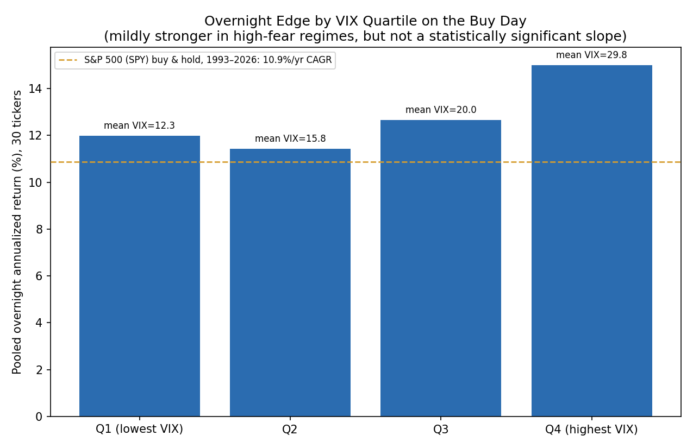

# Is the overnight edge stronger in high-VIX regimes? Is it timeable?

**Question:** `report.md` already establishes *where* (growth/attention sectors) and *when in the week* (Monday's close) the overnight effect concentrates, and `recency_regime_analysis.md` shows it rotates across calendar time. It never conditions on market volatility regime, even though the literature already cited in `literature_review.md` predicts it should: Berkman et al. (2012) tie the effect to retail-driven sentiment and attention, and an uncertainty-resolution story (there is more overnight uncertainty to resolve by the next open when the market is already fearful) would predict a stronger effect in high-VIX periods. If true, that would make the edge partly *timeable*: deploy more capital, or exclusively trade, when VIX is elevated.

**Method:** `scripts/fetch_vix.py` pulls the full VIX history (1990-2026, 9,228 daily rows) via a direct Yahoo chart-API request (the yfinance wrapper hit the same crumb bug documented in `fetch_data.py`'s docstring; a plain `range=max` request also silently truncated to ~440 rows, so this uses explicit `period1`/`period2` unix timestamps instead), cached to `data/VIX.csv`. `scripts/vix_regime_analysis.py` then pools every overnight-leg observation across the 30-ticker cross-section (excl. SPY/QQQ/MU, consistent with `analyze.py`), tags each one with the VIX close on the day its position was bought, and:

1. Splits into quartiles of the VIX level's own full-history distribution and runs a HAC-robust mean test per bucket.
2. Runs a single HAC-robust regression of the pooled overnight return on the VIX level (scaled per 10 points) and the day-over-day percentage change in VIX, to separate "does the level of fear matter" from "does a fear spike matter."
3. Splits at the conventional VIX = 20 "elevated fear" threshold as a sanity check independent of this dataset's own quartile boundaries.

## Result: a mild monotonic pattern in the raw averages, but no statistically significant regime dependence

| VIX quartile | Mean VIX | n | Ann. return | t-stat |
|---|---:|---:|---:|---:|
| Q1 (lowest) | 12.3 | 59,076 | 11.98% | 11.44 |
| Q2 | 15.8 | 59,603 | 11.44% | 10.50 |
| Q3 | 20.0 | 58,653 | 12.66% | 9.10 |
| Q4 (highest) | 29.8 | 59,573 | **15.01%** | 8.06 |

The top VIX quartile does show the highest raw annualized return (15.0% vs 11.4-12.7% elsewhere), consistent with the uncertainty-resolution story. But the HAC-robust regression of the pooled daily return directly on VIX level finds this is not a statistically reliable slope: the coefficient is 0.28bps per 10-point VIX move with t = 0.53 (p = 0.59), and the VIX day-over-day change coefficient is also insignificant (t = -1.41, p = 0.16). The R-squared of the regression is 0.0000183, meaning VIX explains essentially none of the day-to-day variation in the overnight return. The VIX-20 threshold split tells the same story: 13.3% annualized above 20 vs 12.5% below, both strongly significant on their own (as basically every cut of this dataset is, per `report.md`'s headline finding) but not meaningfully different from each other.

**Read honestly, not selectively:** the Q4 bucket's 15% looks like a story, but a coefficient with t = 0.53 across 236,905 observations is not a real effect by any reasonable standard, and four quartile means alone are exactly the kind of "eyeball the bar chart" pattern that Berkman et al.'s framework would predict but that this dataset does not confirm at a statistically robust level. A more honest summary is: high-VIX days are *not worse* for the overnight edge (there's no evidence the effect breaks down in stress regimes, which is itself useful and consistent with the crisis-window survival already shown in `portfolio_backtest.md`), but there isn't a reliable, tradeable timing signal here either. This is a real, if unglamorous, finding: the effect looks like a stable, regime-independent characteristic rather than a fear-driven phenomenon that could be dialed up and down with a VIX filter.

## What this changes

Nothing in the core report is revised. This adds one new, honestly-reported null result to the robustness case: the overnight effect does not appear to be a volatility-regime-conditional phenomenon, which rules out one plausible mechanism (pure fear/uncertainty-resolution) as the dominant explanation and means a VIX-based capital-allocation overlay would not be expected to improve on simply staying invested at a constant weight, consistent with the day-of-week and extreme-gap analyses already showing the effect is broad-based rather than concentrated in a specific, filterable subset of days.
