# Overnight vs. Intraday Returns: Is There a General Edge?

## Why this exists

This started from a [viral tweet](https://x.com/wheelieinvestor/status/2090827673136472542?s=48) ([@wheelieinvestor](https://x.com/wheelieinvestor), reproduced in [`assets/inspiration_tweet.png`](assets/inspiration_tweet.png) for commentary/attribution) claiming Micron (MU) is up **+138,330,342%** if you only held it overnight (buy at close, sell at next open) since 1990, and **-99.92%** if you only held it during the trading day (buy at open, sell at close). That specific claim [checked out](#appendix-the-original-mu-claim) against real MU price data. The question this project answers is different: **is that a Micron-specific fluke, or a real, tradable, market-wide edge?**

> **Methodology v2.** This report was rebuilt after an independent institutional-style review flagged two material issues in the first pass: (1) unadjusted price data was letting ex-dividend gaps leak into the overnight leg, artificially inflating the apparent effect in high-yield sectors, and (2) the "real edge" framing hadn't been tested against known risk factors, so it could have just been repackaged momentum exposure. Both are fixed below; see the [methodology](#1-method) and [§4](#4-is-this-just-repackaged-momentum). The core numbers changed modestly; the qualitative conclusions did not.

## 1. Method

- **Universe:** 33 liquid large-caps spanning all 11 GICS sectors (3-4 names each) plus SPY, QQQ, and MU as benchmarks/focus names. Full ticker list in [`scripts/fetch_data.py`](scripts/fetch_data.py). This is a deliberate departure from testing MU alone: a single winning stock's history is exactly the kind of sample survivorship bias warns against.
- **Data:** Full available daily OHLC history per ticker from Yahoo Finance, **adjusted for both splits and dividends** (`auto_adjust=True`: Open, High, Low, and Close all use the same adjustment factor). An earlier version of this script used raw, dividend-*unadjusted* prices, which put every ex-dividend price drop mechanically into the overnight leg (`open[t]/close[t-1]`) since Yahoo's raw Close is conventionally dividend-adjusted but raw Open is not, inflating the apparent overnight edge for high-yield sectors by roughly their dividend yield. Fixed by re-pulling with consistent adjustment. History ranges from 1962 for the oldest names to 2010+ for newer listings; MU itself: 1984-06-04 to 2026-08-21, 10,637 trading days. Cached in `data/*.csv`.
- **Decomposition:** every trading day's return is split into two legs:
  - **Overnight**: `open[t] / close[t-1] - 1`, the return earned while the market is *closed*.
  - **Intraday**: `close[t] / open[t] - 1`, the return earned while the market is *open*.

  These compound multiplicatively back to the stock's actual return (`overnight × intraday = buy-and-hold`), so this is a decomposition, not an approximation.
- **Significance testing:** all t-statistics use **Newey-West HAC-robust standard errors** ([`scripts/stats_utils.py`](scripts/stats_utils.py)), not naive `std/sqrt(n)`. Daily equity returns are autocorrelated and volatility-clustered, so with n in the thousands a naive t-test overstates significance.
- **Tests run per ticker:**
  1. Mean daily return, annualized return, annualized volatility, Sharpe, HAC t-statistic and p-value for each leg.
  2. **Breakeven transaction cost**: the flat round-trip cost (in bps) that, subtracted from every day's return, drives the leg's compounded return to exactly zero. Binary-searched per ticker.
  3. **Sub-period split**: first half vs. second half of each ticker's available history, to check the effect isn't an artifact of one regime or an accident of the exact date range used.
  4. **Factor regression**: each leg's daily return regressed (HAC-robust) on the Fama-French Mkt-RF/SMB/HML factors plus momentum, to test whether any "edge" survives controlling for known risk exposures. See [§4](#4-is-this-just-repackaged-momentum).
- **Cross-sectional tests:** one-sample and paired t-tests across ticker-level mean returns, run on a **30-ticker population that excludes SPY, QQQ, and MU**. SPY/QQQ are baskets that overlap with the other 30 constituents (double-counting), and MU was the hand-picked motivating case for this whole project (selection bias). All three are still analyzed and charted individually.
- **Multiple comparisons:** individual-ticker significance counts are reported both raw and after Benjamini-Hochberg false-discovery-rate control, since testing 30 tickers at 95% confidence should produce ~1.5 false positives by chance alone.

Full numeric output: [`reports/summary.json`](reports/summary.json) (cross-sectional) and [`reports/per_ticker_results.json`](reports/per_ticker_results.json) (per-ticker, incl. factor regressions). Reproduce fully offline with `python3 scripts/analyze.py && python3 scripts/make_charts.py` (uses committed `data/*.csv` and `data/factors/`); re-fetch with `python3 scripts/fetch_data.py` / `python3 scripts/fetch_factors.py`.

## 2. Headline result: the pattern is real, but it is not the MU pattern

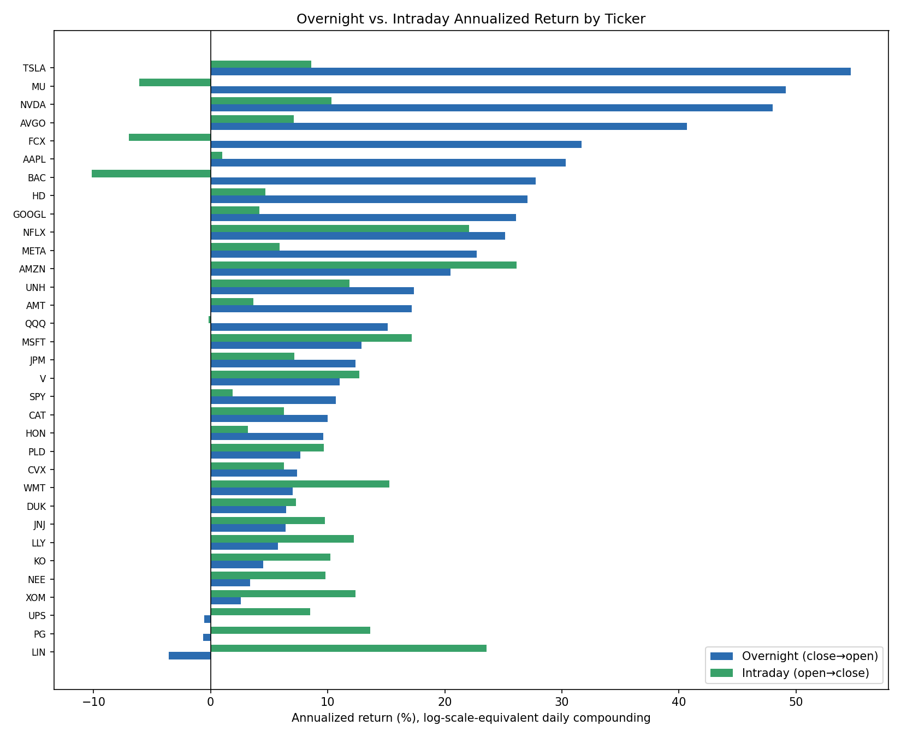

The dashed gold line marks SPY's own realized buy-and-hold CAGR over this project's full sample window (1993-2026: 10.9%/yr), the standard "long-term S&P 500 average return" benchmark. Any bar that clears it is beating the market on that leg alone: most of the overnight bars do, most of the intraday bars don't, which is the clearest single visual of where the "alpha" in this whole topic actually comes from.

| | Overnight leg | Intraday leg |
|---|---:|---:|
| Cross-sectional mean daily return (30 tickers, excl. SPY/QQQ/MU) | **+5.74 bps/day** | +3.37 bps/day |
| Cross-sectional t-stat (vs. zero) | 6.61 (p < 0.0001) | 6.58 (p < 0.0001) |
| % individually significant, raw (95%) | 86.7% positive | 3.3% negative |
| Individually significant after Benjamini-Hochberg FDR control | **26 / 30** (vs. ~1.5 expected by chance) | 16 / 30 |
| Paired t-test, overnight mean > intraday mean across tickers | t = 2.07, **p = 0.047** | n/a |

Two things are true at once:

1. **The overnight leg is a genuine, statistically significant, broad-based phenomenon, and it survives multiple-comparisons correction.** 26 of 30 tickers remain significant after Benjamini-Hochberg FDR control, against an expected ~1.5 false positives by chance. This replicates the published literature (see [§8](#8-is-there-academic-basis-for-this)); it is not noise, and not a multiple-testing artifact.
2. **The MU-style pattern (massive overnight gains *and* a losing intraday leg) is still not the general case.** Only BAC (and FCX marginally) join MU with a significantly *negative* intraday leg. For most stocks, both legs are positive; overnight is usually the bigger slice, but intraday isn't burning money, it's just growing slower.

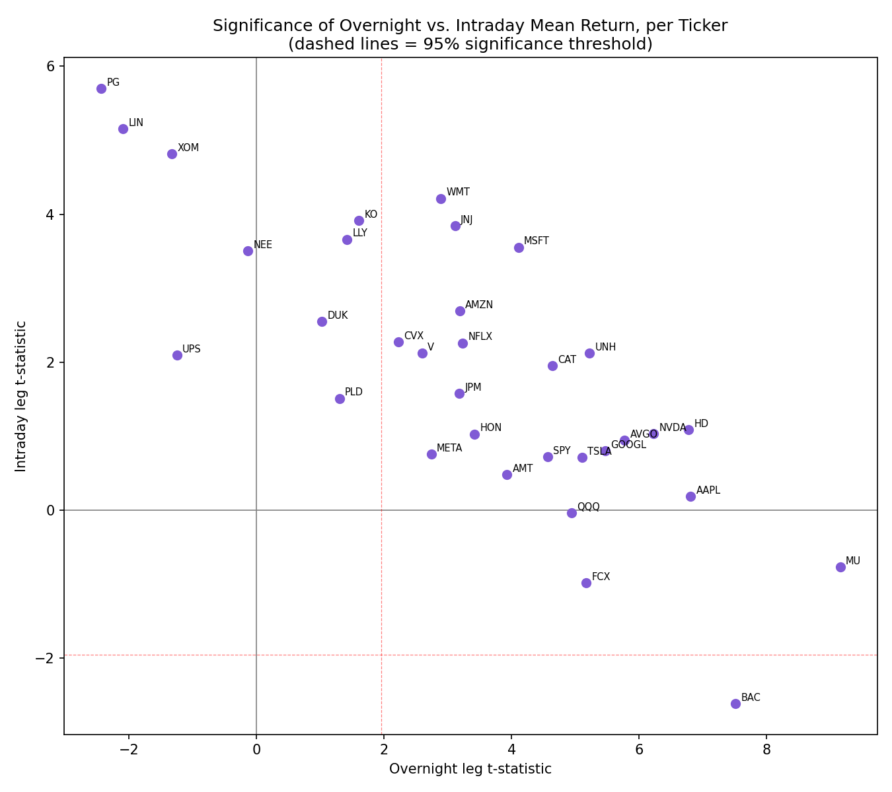

In the scatter above, MU, BAC, and FCX are alone in the bottom-right quadrant (overnight strongly positive AND intraday negative). Everyone else with a strong overnight effect (AAPL, NVDA, TSLA, AVGO, HD) still has a *positive*, just statistically weaker, intraday leg.

One change from the dividend-adjustment fix: the cross-sectional paired test (overnight mean > intraday mean) now lands at **p = 0.047**, barely significant, versus p = 0.067 (not significant) before the fix and before excluding SPY/QQQ/MU from the pool. Read that "barely" literally: this is not a strong result, and a different but equally reasonable 30-ticker draw could easily land on either side of 0.05.

## 3. Where the effect concentrates: growth/attention sectors, not the whole market

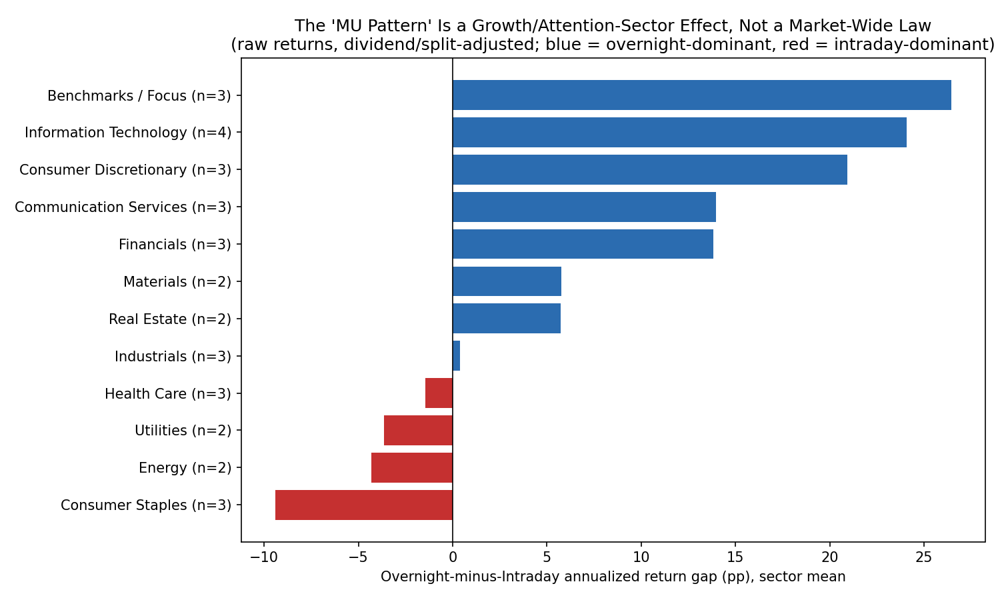

Grouping by GICS sector still makes the pattern explicit even after the dividend fix. The overnight-dominant effect concentrates in **Information Technology, Consumer Discretionary, Communication Services, and Financials**, sectors full of high-volatility, high-retail-attention, "story" stocks. It **reverses** in **Consumer Staples, Energy, Utilities, and (mildly) Health Care**, the boring, low-attention, dividend-paying end of the market, where the *intraday* session now captures more of the return even with the dividend-leakage artifact removed.

This lines up with the leading academic explanation for the overnight effect (retail investors chasing high-attention stocks at the open, see §8): staples and utilities don't attract that kind of speculative morning order flow, so they don't show the pattern.

**Practical read:** "buy the close, sell the open" is closer to a **growth/momentum-stock characteristic** than a market-wide law. Applying it uniformly across a diversified portfolio would be fighting the data in roughly a third of your sectors.

## 4. Is this just repackaged momentum?

The literature this project draws on (Lou-Polk-Skouras) explicitly frames overnight returns as a momentum-clientele effect, which raises the obvious question: is "the overnight edge" just exposure to the standard momentum factor wearing a costume? Each ticker's overnight leg was regressed (HAC-robust) on Mkt-RF, SMB, HML, and Momentum; the intercept (**alpha**) is the return left over after controlling for all four.

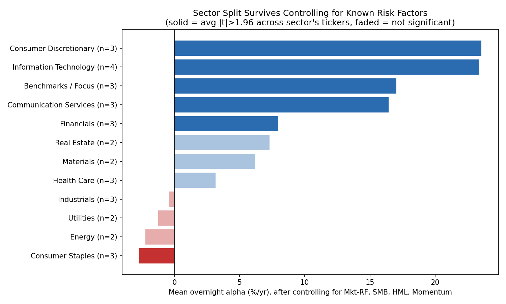

The sector split survives almost unchanged after stripping out factor exposure. Consumer Discretionary and Information Technology still show the largest positive alpha, Consumer Staples the most negative, and the ordering is nearly identical to the raw chart in §3. **16 of 30 tickers retain a statistically significant overnight alpha** after controlling for all four factors (mean +8.6%/yr across the cross-section); 3 (PG, XOM, LIN) have a *significantly negative* alpha.

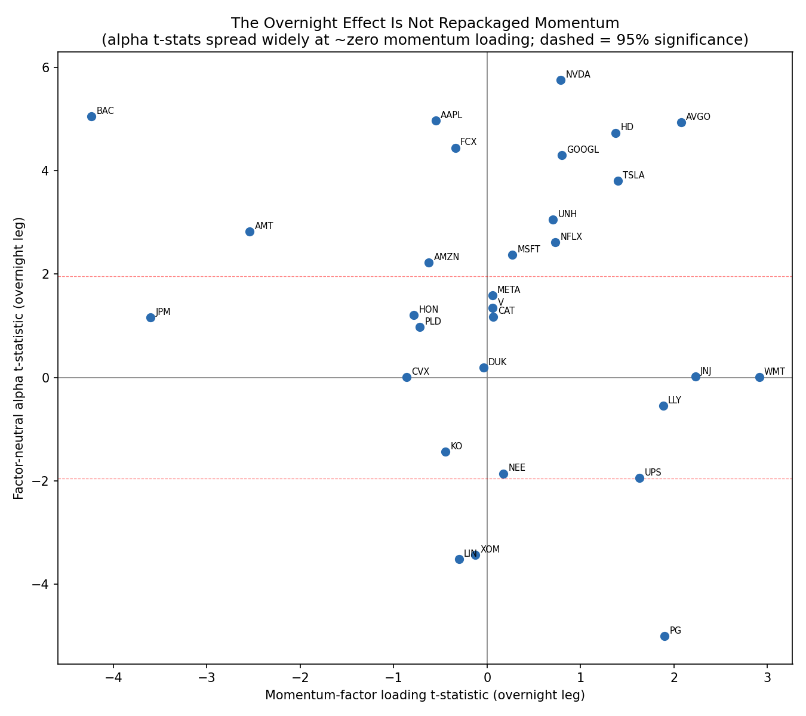

More directly: the mean momentum-factor loading on the overnight leg across the cross-section is **0.0015 (t = 0.13)**, statistically indistinguishable from zero. The scatter above shows alpha t-statistics spread widely from -5 to +6 while momentum-loading t-statistics cluster tightly around zero for almost every ticker; there's no relationship between "how exposed is this stock's overnight leg to momentum" and "how big is its overnight alpha." **This is not repackaged momentum.** Whatever is producing the sector split in §3, it isn't showing up as standard momentum-factor exposure.

## 5. Does it survive costs and time? Partially.

**Persistence:** splitting each ticker's own history into a first half and second half, the cross-sectional correlation of overnight annualized return is **0.65** (tickers with a strong overnight effect early tend to keep it later) vs. much weaker for the intraday leg. That's evidence the overnight effect is closer to a real, persistent stock characteristic than the intraday leg is.

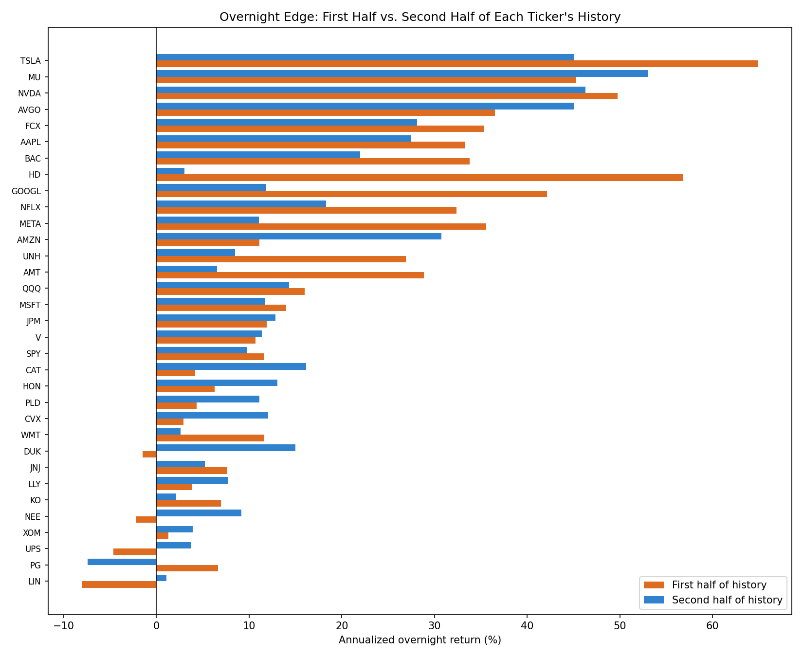

**Transaction costs are still the real problem.** For each ticker, we solved for the flat round-trip cost that would erase the entire compounded overnight edge:

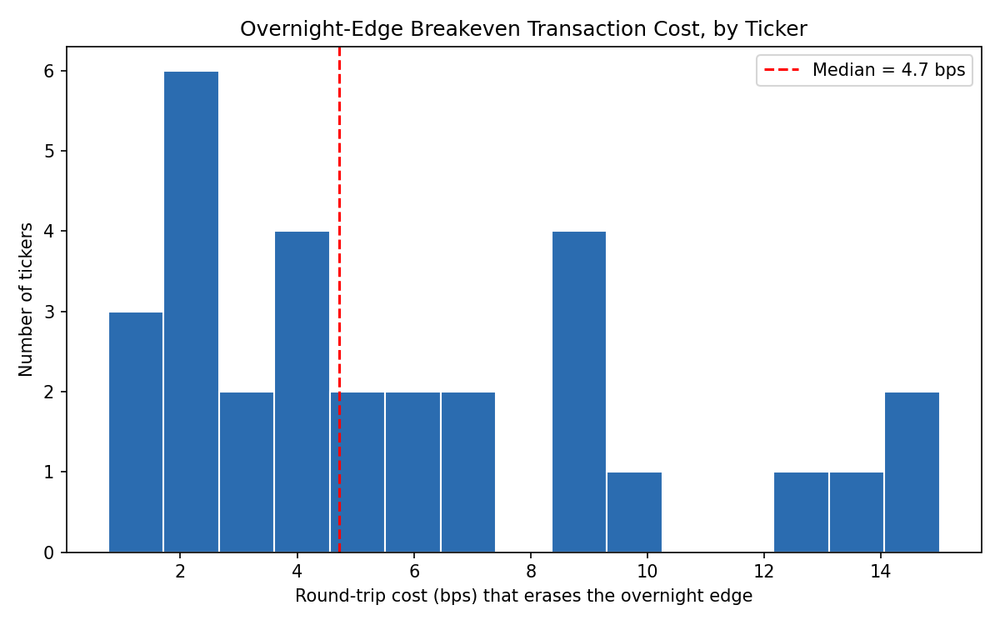

- **27 of 30** cross-section tickers have a gross-profitable overnight leg at all.
- Median breakeven cost: **4.2 bps round-trip** (down slightly from the pre-fix estimate: some of the apparent margin in defensive names was the dividend artifact). Half of the profitable names (14/27) lose their entire edge to a cost below 5bps.
- Even the most extreme cases in the whole universe, **TSLA (15.0bps), MU (14.3bps), NVDA (13.3bps)**, only survive costs up to ~13-15bps round-trip. This is a *daily* number compounding over 4,000-10,600 trading days: even a cost that looks negligible on any single day fully erases decades of the headline result.

This is the actual answer to "is there a tradable edge": **gross of costs, yes, a real, factor-distinct, FDR-robust effect for roughly half the names tested, concentrated in growth sectors. Net of realistic execution costs, the margin of safety is razor-thin to nonexistent for the median stock**, and only comfortably survives costs for a handful of high-volatility names that also carry the highest overnight *gap risk* (the same mechanism that produces big up-gaps produces big down-gaps on bad news).

## 6. Does timing within the week matter, and is it just a few big nights?

Two follow-up questions, each with its own dedicated background note since the methodology needs more caveats than fit cleanly here.

**Which weekday should you buy the close on?** It matters, a lot.

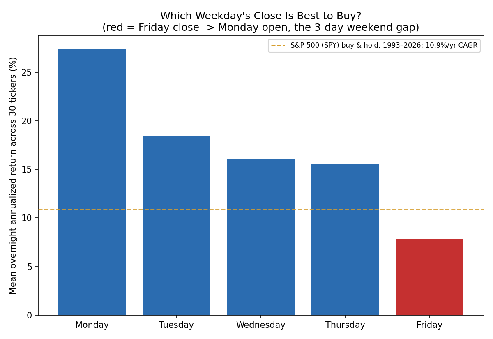

Splitting the overnight leg by the weekday of the close being bought, Monday is the strongest day of the week (27.4% mean annualized return across the cross-section) and Friday, the 3-day weekend gap into Monday's open, is the weakest (7.8%), both statistically significant (p < 0.001). This is a new finding for this project, not confirmed anywhere in the literature reviewed in §8, so treat it as an empirical pattern in this dataset rather than an established result. Full writeup: [`background/day_of_week_analysis.md`](background/day_of_week_analysis.md).

**Is the edge just a handful of earnings-like gap nights?** Mostly no.

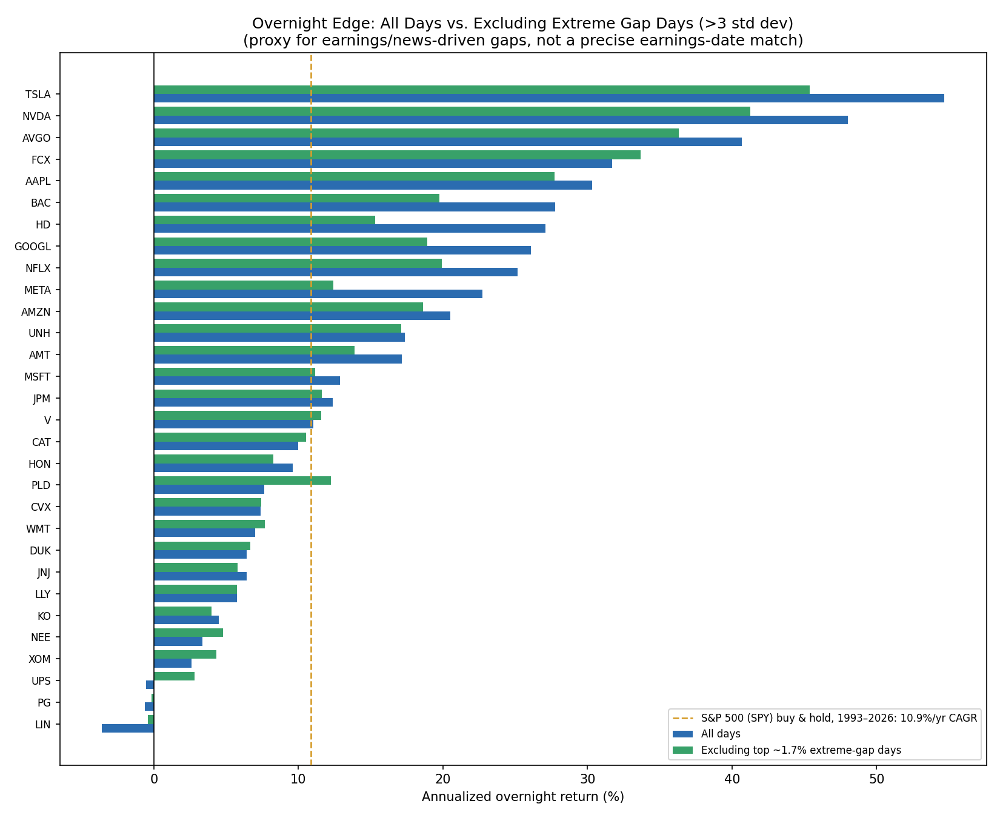

Flagging the ~1.7% of days with the most extreme overnight moves (>3 standard deviations, a proxy for earnings/news gaps since precise historical earnings-date data isn't available for free at this depth) and removing them, 27 of 30 tickers keep a statistically significant positive overnight return, and the cross-sectional mean only falls from 16.4% to 14.5% annualized. The effect is broad-based for most names, though a handful of the biggest headline numbers (TSLA, HD, BAC, GOOGL, NVDA, AVGO) lean more heavily on tail events than the average name does. Full writeup: [`background/extreme_gap_analysis.md`](background/extreme_gap_analysis.md).

## 7. Has the edge decayed recently?

Motivated by a Federal Reserve Bank of New York paper, ["The Disappearing Overnight Drift"](https://libertystreeteconomics.newyorkfed.org/2026/07/the-disappearing-overnight-drift/), which finds a narrow 2:00-3:00am ET window in S&P 500 futures (the European market open) averaged +3.7%/yr from 1998-2020 but has averaged close to zero since 2021, attributed to a compression in end-of-day order-imbalance dispersion, not a change in volatility.

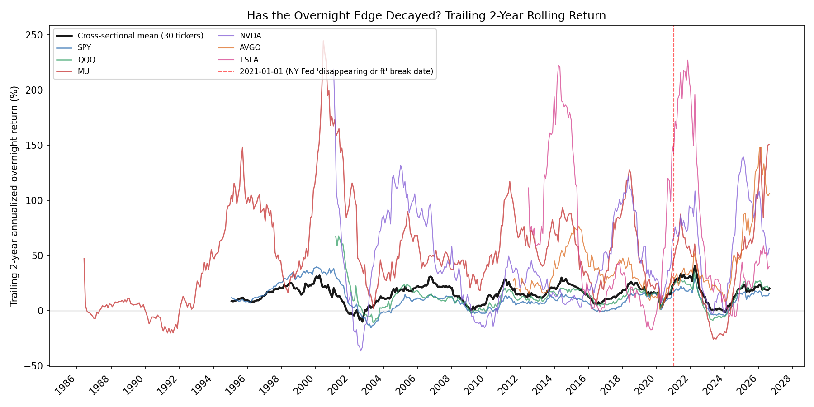

**No, not at the aggregate level, though the composition underneath has shifted a lot.** This project can't isolate that specific 2-3am window (daily OHLC only, no intraday ticks), but testing the full overnight leg across the 30-ticker cross-section: the pre-2021 vs. post-2021 mean annualized return (17.97% vs. 13.24%) is not a statistically significant change (paired t = 1.38, p = 0.18), and the rolling 2-year chart above shows no visible break at 2021. 8 of 30 tickers remain individually significant post-2021 after Benjamini-Hochberg FDR correction, well above the ~1.5 expected by chance, despite a much smaller post-break sample.

But aggregate stability hides real rotation: TSLA, AAPL, HD, GOOGL, NFLX, and META, the growth/attention names that drove much of the pre-2021 effect in §3, all faded sharply post-2021 (AAPL actually flips to a small, insignificant negative), while AVGO, LLY, CAT, CVX, XOM, and NEE all strengthened. This looks more like retail/market attention rotating to new names (the AI/semiconductor cycle since 2023) than a single structural mechanism fading market-wide the way the NY Fed's narrow futures-window finding describes. Full writeup, including the caveat that this project didn't independently validate 2021 as *its own* optimal break date: [`background/recency_regime_analysis.md`](background/recency_regime_analysis.md).

## 8. Is there academic basis for this?

Yes, this is a well-documented phenomenon, not a chart trick. Key references (full literature review with links: [`background/literature_review.md`](background/literature_review.md)):

- **French & Roll (1986)**: first documented that volatility (and by extension return patterns) differs sharply between trading and non-trading hours for the aggregate market.
- **Berkman, Koch, Tuttle & Zhang (2012, *Journal of Financial and Quantitative Analysis*), "Paying Attention: Overnight Returns and the Hidden Cost of Buying at the Open"**: the leading mechanism. Retail investors queue orders overnight and buy attention-grabbing stocks right at the open, pushing the open price up; institutions fade that flow intraday, pulling the price back down by the close. This is consistent with what §3 finds: the effect concentrates in the stocks retail investors actually chase (growth/tech/consumer names), not staples and utilities.
- **Lou, Polk & Skouras (2019, *Journal of Financial Economics*), "A Tug of War: Overnight Versus Intraday Expected Returns"**: shows overnight and intraday returns behave like two separate return series with opposite momentum/reversal signatures, driven by different investor clienteles. §4's factor regression is a direct empirical check on this paper's own momentum framing, and finds the momentum loading itself isn't what's driving it here.
- Follow-on market-microstructure work confirms retail and institutional order-flow imbalances are negatively correlated: wholesalers internalize retail flow specifically to offset institutional demand, mechanically producing the open-high/close-low pattern in attention-grabbing names.

## 9. Is this actually tradeable? A full portfolio backtest

Everything above is descriptive: does the pattern exist, is it significant, does it survive controls. This section is different: a simulated, day-by-day equal-weight portfolio of all 30 cross-section tickers, bought at close and sold at next open (and, for contrast, the intraday-only version), net of a 5bps round-trip cost, run against real SPY buy & hold over the full 1993-2026 window.

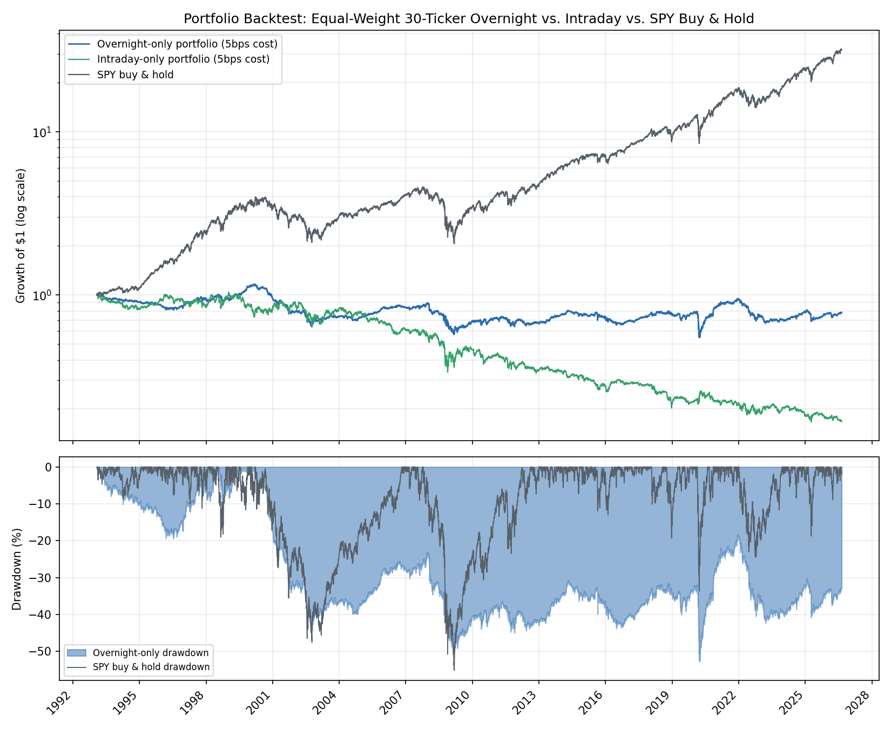

**No, not at a realistic cost.** At 5bps round-trip, matching the convention used in this project's sibling VIX-regime-switch backtest, the diversified overnight-only portfolio loses money: CAGR -0.73%, Sharpe -0.02, a max drawdown of -52.83% that it stays underwater from for roughly 26 of the 33 years tested. It is still clearly the better of the two legs (intraday-only loses far more: CAGR -5.19%, growth of $1 to just $0.17), consistent with everything else in this report, but "less bad" is not "profitable."

**Why this is worse than the per-ticker breakeven analysis in §5 suggested:** that analysis found a median single-ticker breakeven of ~4.2bps and a cross-sectional mean overnight return of 5.74bps/day, numbers unweighted across each ticker's own full history. A real portfolio's daily return is instead weighted by whichever tickers actually existed that day, and the early decades of this backtest (1993-2010) held far fewer names and specifically lacked the growth/semiconductor names (NVDA, META, TSLA, AVGO) that carry the strongest individual overnight edge. The portfolio's own solved breakeven cost is **4.71bps**, close to but still below the 5bps this project treats as realistic.

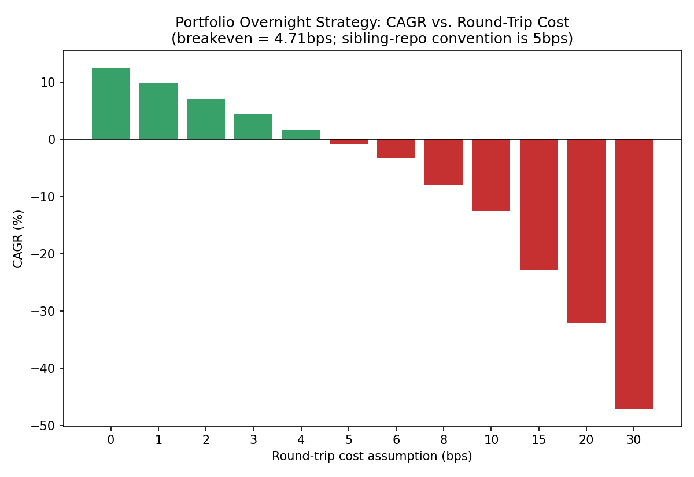

Below that breakeven the picture is genuinely attractive (0bps cost: 12.60% CAGR, beating SPY's 10.87%, at little more than half SPY's volatility), so the entire practical question comes down to whether an implementation can execute below ~4.7bps round-trip, plausible for the most liquid names via MOC/MOO at a broker like Interactive Brokers (see [`background/execution_mechanics.md`](background/execution_mechanics.md)).

**Rebuilding the cost model with IBKR Pro's actual fee schedule instead of the flat 5bps assumption answers that question directly, and it depends entirely on account size.** IBKR Pro charges $0.0035/share with a $0.35 per-order minimum; that minimum is a large fraction of a small trade and negligible on a large one, so cost isn't one number, it's a function of capital.

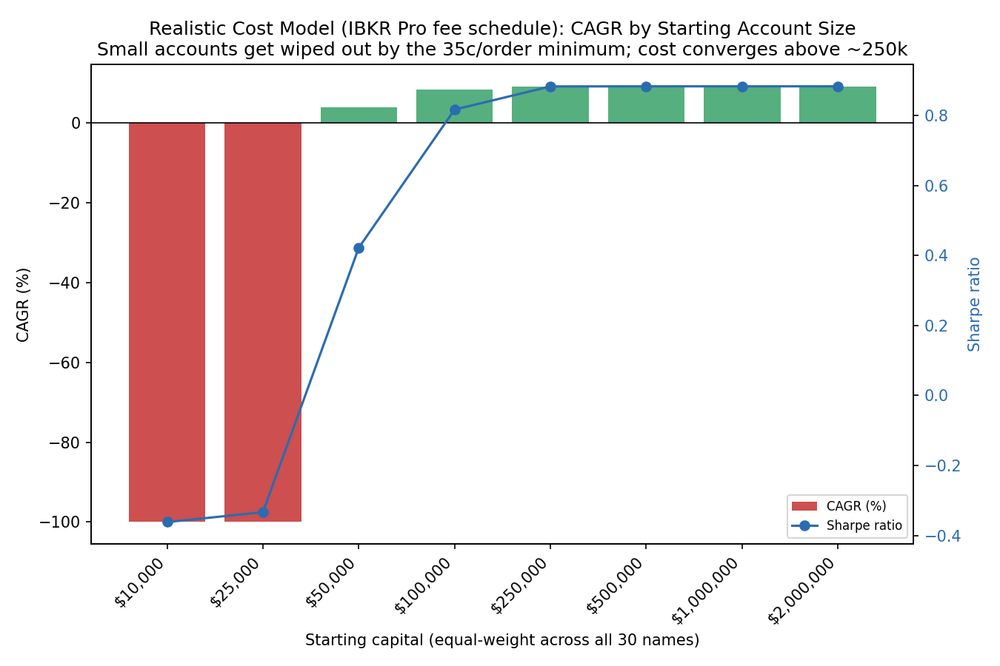

| Starting capital | CAGR | Sharpe | Outcome |
|---|---:|---:|---|
| $10,000-$25,000 | **-100%** | -0.3 to -0.4 | Wiped out by ~2004 |
| $50,000 | 3.99% | 0.42 | Marginal, survives |
| $100,000 | 8.43% | 0.82 | Solid |
| $250,000+ | **9.20%** | **0.88** | Converged, beats SPY's Sharpe |

Below roughly $30-40k, the strategy is not just unprofitable but **ruinous**: small positions mean the $0.35 minimum alone costs 15-20+bps round-trip, and losses compound into smaller positions, which raises the effective cost further, a reflexive spiral to total capital destruction that a flat-bps model cannot represent (the $25,000 equity path below is essentially gone by 2004). At $100k and above, cost converges to ~1.2bps round-trip, comfortably under the 4.71bps breakeven, and CAGR converges to 9.20%, just under SPY's, but at roughly half the volatility and a better Sharpe ratio (0.88 vs. SPY's 0.65).

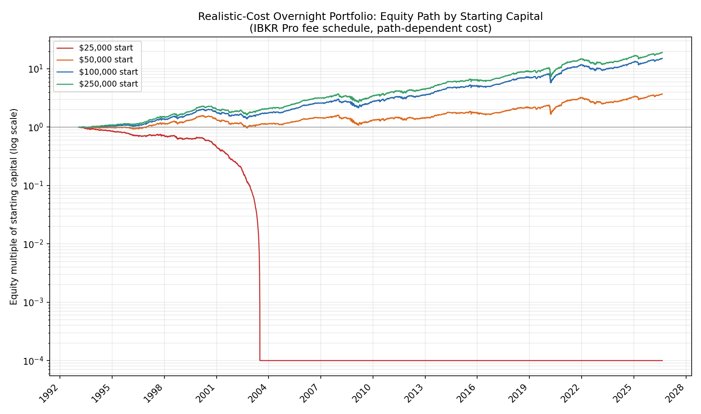

**This revises the flat-5bps result above rather than replacing it.** The flat 5bps assumption is too pessimistic for a realistically-capitalized account (real cost converges far below it) and far too optimistic for a small one (real cost can exceed 20bps and cause total ruin, which no flat number can show). Full methodology, including a bug in an earlier version of this calculation that was caught and fixed (using split-adjusted historical prices to estimate historical share counts, which overstated 1990s-era commissions by 5-6x), is in [`background/portfolio_backtest.md`](background/portfolio_backtest.md).

**Crisis behavior (flat-5bps version) is not uniformly protective.** The overnight portfolio meaningfully outperformed SPY during the 2008-09 GFC (-17.6% vs. -36.6%), the 2010 Flash Crash, and the 2018 Q4 selloff, but meaningfully underperformed during the 2020 COVID crash (-20.1% vs. -13.6%) and the 2022 rate-hike bear market (-24.4% vs. -18.2%), the two most recent major drawdowns. Overall beta vs. SPY is 0.32 (expected, given it's invested only half of each day), but annualized alpha is **-3.97%/yr** at the 5bps cost this section uses, negative even after adjusting for that lower beta exposure.

Important limitation carried into this section: **idle cash yield is not modeled** (live T-bill data proved unreliable to fetch in this environment), which understates both simulated portfolios' real-world return relative to SPY buy & hold, since SPY captures 100% of every trading day while these strategies are only ever invested for half of each day-night cycle. Full method, all caveats, and the exact numbers behind every claim above: [`background/portfolio_backtest.md`](background/portfolio_backtest.md).

## 10. Three further stress tests: correlation risk, volatility regime, and a momentum overlay

Everything above establishes that the effect is real, where it concentrates, and whether a diversified implementation is tradeable. Three further questions, prompted by an independent review of what else this dataset could answer, each get a dedicated background note since the methodology needs more room than fits here.

**How much real diversification does the 30-name portfolio actually have?** Less than it looks. The correlation matrix of the 30 tickers' overnight returns shows a mean pairwise correlation of 0.38, with a single common factor explaining 41% of the cross-sectional variance; the eigenvalue spectrum implies the book behaves like roughly **5 independent bets**, not 30. The overnight leg's downside tail is also fatter than its own volatility would predict under a normal distribution (1% CVaR is 1.71x the Gaussian-implied figure, versus 1.4x for the intraday leg), and 8 of the 10 worst single days for the equal-weight portfolio cluster into just three systemic-crisis windows (COVID March 2020, the 2008 GFC, and the August 2015 China-deval selloff). This doesn't change any realized number in [§9](#9-is-this-actually-tradeable-a-full-portfolio-backtest), which is measured directly from the equity curve, but it explains *why* the portfolio's volatility isn't lower than it is despite holding 30 names, and confirms its risk is concentrated in correlated macro-shock nights, not spread evenly across idiosyncratic single-stock risk. Full writeup: [`background/correlation_tail_risk_analysis.md`](background/correlation_tail_risk_analysis.md).

**Is the edge timeable by volatility regime?** No reliable signal found. Pooling all 30 tickers' overnight returns and conditioning on the VIX level at the buy-day close, the top VIX quartile does show the highest raw annualized return (15.0% vs. 11.4-12.7% in the other three quartiles), consistent with an uncertainty-resolution mechanism. But a HAC-robust regression of the pooled return directly on VIX level finds no statistically reliable relationship (t = 0.53, p = 0.59, R-squared effectively zero across 236,905 pooled observations), and neither does a regression on the day-over-day change in VIX. The honest read: the effect does not appear to break down in high-stress regimes (useful, and consistent with §9's crisis-window survival), but there's no evidence of a tradeable VIX-based timing overlay either. Full writeup: [`background/vix_regime_analysis.md`](background/vix_regime_analysis.md).

**Does a stock's own trailing overnight performance predict its future overnight performance?** Yes, strongly, and it's the most promising unexplored lever in this whole project. Sorting the cross-section into terciles by trailing overnight momentum (tested at 5, 21, and 63-day lookback windows, all local, no new data) and holding only the top tercile produces an annualized top-minus-bottom spread of 22.7-28.8%, highly significant at every horizon (t = 13.4-16.6) and robust to restricting the sample to the same 1993-2026 window used in §9 (top tercile: 11.2% CAGR, Sharpe 0.89 vs. equal-weight-all's -0.84% CAGR, Sharpe -0.03 over that window). At the headline 21-day window and the same flat 5bps cost used in §9, top-tercile-only produces Sharpe 1.16, better than either the naive equal-weight portfolio or SPY's 0.65. One caveat worth stating plainly: over multi-decade horizons, part of what a persistent-loser sort like this can capture is structural company quality or distress rather than a short-horizon overnight-specific signal, a distinction this dataset can't fully separate. Full writeup: [`background/overnight_momentum_analysis.md`](background/overnight_momentum_analysis.md).

## 11. Bottom line

| Question | Answer |
|---|---|
| Is the original MU chart's math right? | Yes, independently reproduced (see appendix). |
| Does the *extreme* MU pattern (huge overnight gain, losing intraday) generalize across the market? | **No.** Only MU, BAC, and FCX show it out of 33 names; it's the exception, not the rule. |
| Is there a *real, general* overnight-return effect at all? | **Yes.** 26 of 30 sector-diversified tickers remain significant after FDR correction (vs. ~1.5 expected by chance), matching published academic findings. |
| Does it concentrate anywhere? | **Yes**, in growth/high-attention sectors (Tech, Discretionary, Comm Services, Financials). It *reverses* in Staples, Energy, Utilities. |
| Is it repackaged momentum? | **No.** Momentum-factor loading on the overnight leg is statistically zero (t=0.13); 16/30 tickers retain significant alpha after controlling for market/size/value/momentum. |
| Does the weekday you buy matter? | **Yes.** Monday's close is the strongest (27.4% mean annualized), Friday's close (the weekend gap) the weakest (7.8%), both p<0.001. New to this project, not independently confirmed in the literature. |
| Is it just a few earnings-like pops? | **Mostly no.** Only ~1.7% of days are extreme gaps; 27/30 tickers stay significant with those days excluded, and the mean annualized return only falls 16.4%→14.5%. |
| Has the edge decayed recently (post-2021)? | **Not at the aggregate level** (17.97%→13.24% annualized, p=0.18, not significant; 8/30 tickers still significant after FDR). But real rotation underneath: TSLA/AAPL/HD/GOOGL/NFLX/META faded, AVGO/LLY/CAT/CVX/XOM/NEE strengthened. |
| Is it persistent over time? | Reasonably: 0.65 cross-sectional correlation between first-half and second-half overnight returns. |
| Is it a free lunch net of costs, per-ticker? | **No.** Median breakeven cost is ~4.2bps round-trip; even the best cases (TSLA, MU, NVDA) only tolerate ~13-15bps. |
| **Would a real, diversified, cost-aware portfolio actually have made money?** | **It depends entirely on account size.** At a flat 5bps assumption, no (CAGR -0.73% vs. SPY's 10.87%). Rebuilt with IBKR Pro's real fee schedule: **ruinous below ~$30-40k** (total capital loss by ~2004, a reflexive small-position death spiral), **marginal at $50k** (3.99% CAGR), **solidly profitable at $100k+** (CAGR converges to 9.20%, Sharpe 0.88, beating SPY's 0.65 Sharpe at roughly half the volatility). This is the single most important nuance in the whole report: the effect is statistically real everywhere, but whether it's tradeable is a threshold in dollars, not a yes/no answer. |
| How diversified is the 30-name portfolio really? | **Less than it looks.** The overnight legs behave like roughly **5 independent bets**, not 30 (mean pairwise correlation 0.38, one common factor explains 41% of cross-sectional variance), and the overnight leg's downside tail is 1.71x fatter than a Gaussian with the same mean/vol would predict. 8 of the 10 worst single days cluster into three systemic-crisis windows. |
| Is the edge stronger in high-volatility regimes, i.e. is it timeable? | **No reliable signal.** Raw VIX-quartile averages show a mild upward tilt (11.4-15.0% annualized), but a HAC-robust regression on VIX level finds no statistically significant relationship (t=0.53, R-squared~0). The edge doesn't break down under stress, but there's no tradeable VIX-timing overlay here. |
| Does a stock's own trailing overnight performance predict its future overnight performance? | **Yes, strongly.** Top-vs-bottom tercile spread of 22.7-28.8%/yr annualized, significant at every lookback tested (5/21/63-day, t=13.4-16.6), robust to the 1993-2026 window. A top-tercile overlay would have beaten both naive equal-weighting and SPY on a risk-adjusted basis (Sharpe 1.16 vs. 0.65), though long-run persistence sorts like this can partly reflect company quality/distress rather than a pure overnight-specific signal. |

## Limitations

- Universe is 33 large/mega-cap US names, and doesn't cover small-caps, non-US markets, or delisted/failed companies. The 30-ticker cross-section is still conditioned on "large-cap today," so survivorship bias is reduced (dividend fix, factor-neutrality) but not eliminated: a stock's multi-decade winner status can still concentrate in the overnight leg if the overnight effect is itself momentum-like at the individual-stock level, even though the *aggregate* momentum-factor loading is flat.
- Fama-French factor data currently runs through 2026-06-30, so §4's factor regressions use a slightly shorter window than the full price history (which runs to 2026-08-21); this is a ~7-week truncation against decades of history and immaterial to the conclusions.
- Breakeven cost analysis assumes a flat per-trade cost; real costs vary by name, liquidity, and order type (MOO/MOC auctions specifically, which is what this strategy would require in practice, carry their own execution risk beyond simple spread cost), and an actual overnight holder collects any dividend paid, which isn't separately modeled as a benefit here even though the price-adjustment fix removes it as a distortion.
- Sub-period "first half vs. second half" uses each ticker's own full history, so the split date differs by ticker (not a shared out-of-sample date): this tests persistence of each stock's *own* pattern, not a shared regime shift.
- Sector labels are assigned once, present-day, and applied to each ticker's entire history: a company's sector character can drift over decades (e.g. AMZN's business mix looked very different in 1998 than today).
- Only 2-3 tickers per sector for several sectors (Energy, Materials, Real Estate, Utilities): thin enough that a different random draw of the same sectors could shift the sector-level conclusions in §3-4, even though the overall growth-vs-defensive pattern is unlikely to fully reverse.
- None of the above models taxes, or the real mechanics of actually placing MOC/MOO orders (exchange cutoff times, broker support, execution slippage vs. the official auction print). See [`background/execution_mechanics.md`](background/execution_mechanics.md) for what it would actually take to trade this.
- §9's portfolio backtest does not model idle cash earning a yield during the half of each cycle it isn't invested (live T-bill data was unavailable), doesn't test any weighting beyond naive equal-weight, and inherits the same static-universe survivorship noted above. See [`background/portfolio_backtest.md`](background/portfolio_backtest.md) for the full caveat list.
- §10's momentum-overlay test is in-sample (the signal was tested on the same data used to discover it, with no held-out validation period), and long-horizon trailing-return sorts can partly capture structural company quality/distress rather than a pure overnight-specific effect; see [`background/overnight_momentum_analysis.md`](background/overnight_momentum_analysis.md) for the full discussion.

## Appendix: the original MU claim

Independently reproduced from full MU daily OHLC history, dividend+split adjusted (1990-01-02 to 2026-08-21, 9,227 trading days):

| Leg | This analysis | Original claim |
|---|---:|---:|
| Overnight (buy close, sell next open), compounded | **+182,299,386%** | +138,330,342% |
| Intraday (buy open, sell close), compounded | **-99.94%** | -99.92% |

Close enough to confirm the claim is genuine (not fabricated), with the small gap likely explained by data vendor/adjustment differences or the exact snapshot date. `overnight × intraday ≈ buy-and-hold` checks out internally (both before and after the dividend-adjustment fix), confirming the decomposition wasn't gamed. MU pays no meaningful dividend over most of this window, so the dividend-adjustment fix barely moved its own numbers; the fix mattered for the *sector* conclusions in §3, not for MU itself.

## Disclaimer

Research only, not investment advice. Historical statistical patterns, however well-documented and factor-adjusted, are not guarantees of future returns, and this analysis does not model taxes, real execution mechanics (market-on-open/market-on-close order types), or the risk of adverse overnight gaps on any specific position.
